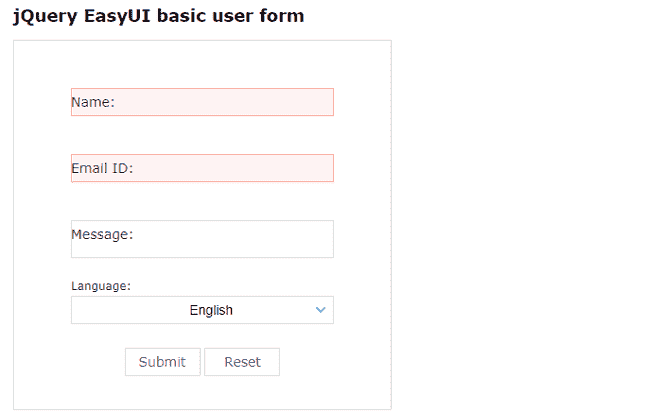
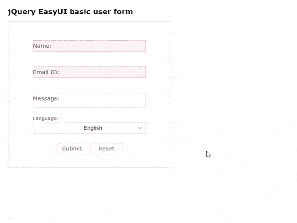
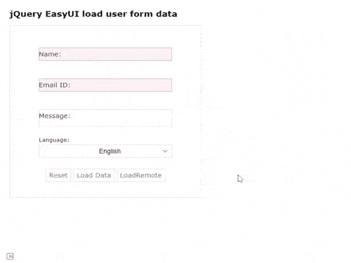
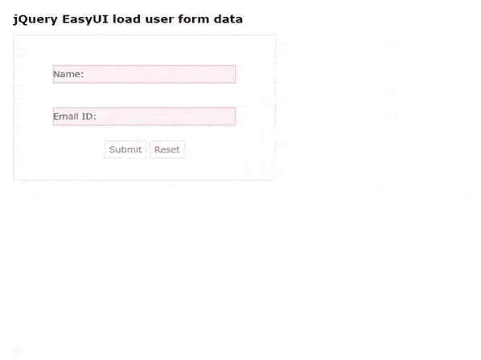

# 如何使用 jQuery EasyUI 加载和验证表单数据？

> 原文:[https://www . geeksforgeeks . org/如何使用-jquery-easyui 加载和验证表单数据/](https://www.geeksforgeeks.org/how-to-load-and-validate-form-data-using-jquery-easyui/)

**EasyUI** 是一个 HTML5 框架，用于使用基于 jQuery、React、Angular 和 Vue 技术的用户界面组件。它有助于构建交互式 web 和移动应用程序的功能，为开发人员节省了大量时间。它有助于构建交互式 web 和移动应用程序的功能，为开发人员节省了大量时间。

从[官网](https://www.jeasyui.com/download/index.php)下载所有需要的预编译文件，保存在你的工作文件夹中。在代码实现过程中，请注意正确的文件路径。

**jQuery 易用户官方网站:**

```html
https://www.jeasyui.com/index.php
```

**示例 1:** 下面的代码演示了使用 **jQuery EasyUI** 框架的基本用户表单的设计。

## 超文本标记语言

```html
<!doctype html>
<html>

<head>
    <meta charset="UTF-8">

    <meta name="viewport" 
      content="initial-scale=1.0, 
      maximum-scale=1.0, user-scalable=no">

     <!-- EasyUI specific stylesheets-->
    <link rel="stylesheet" type="text/css" 
          href="themes/metro/easyui.css">

    <link rel="stylesheet" type="text/css" 
          href="demo.css">  

    <link rel="stylesheet" type="text/css" 
          href="themes/icon.css"> 

    <!--jQuery library -->
    <script type="text/javascript" 
          src="jquery.min.js">
    </script>

    <!--jQuery libraries of EasyUI  -->
    <script type="text/javascript" 
         src="jquery.easyui.min.js">
      </script>
</head>

<body>
    <h2>jQuery EasyUI basic user form</h2>

    <div class="easyui-panel" 
         style="width:100%;max-width:400px;padding:30px 60px;">
        <form id="formID" method="post">

            <!-- Set class to form-floating-label for
                 special labels-->
            <div class="form-floating-label form-field" 
                    style="margin-bottom:20px">
              <!-- easyui-textbox class is used -->
                <input class="easyui-textbox" 
                    name="name" style="width:100%" 
                    data-options="label:'Name:',
                    required:true,
                    labelPosition:'top'">
            </div>

            <!-- set the data-options for HTML validation -->
            <div class="form-floating-label form-field" 
                    style="margin-bottom:20px">
                <input class="easyui-textbox" 
                    name="email" style="width:100%" 
                    data-options="label:'Email ID:',
                    required:true,validType:'email',
                    labelPosition:'top'">
            </div>

            <div class="form-floating-label form-field" 
                    style="margin-bottom:20px">
                <!--set multiline to true for textarea-->
                <input class="easyui-textbox" 
                    name="message" 
                    style="width:100%;height:60px" 
                    data-options="label:'Message:',
                    multiline:true,
                    labelPosition:'top'">
            </div>

            <div class="form-floating-label form-field" 
                    style="margin-bottom:20px">
                <select class="easyui-combobox" 
                    name="language" style="width:100%"
                    data-options="label:'Language:',
                    labelPosition:'top'">            
                    <option value="ar">Arabic</option>
                    <option value="nl">Dutch</option>
                    <option value="en" selected="selected">
                    English</option>
                    <option value="fr">French</option>
                    <option value="de">German</option>
                    <option value="el">Greek</option>
                    <option value="hi">Hindi</option>
                    <option value="ja">Japanese</option>
                    <option value="ko">Korean</option>
                </select>
            </div>
        </form>

        <div style="text-align:center;padding:5px 0">
            <!--To create link using EasyUI -->
            <a href="javascript:void(0)" 
                class="easyui-linkbutton" 
                onclick="submitForm()" 
                style="width:80px">
                Submit
            </a>

            <a href="javascript:void(0)" 
                class="easyui-linkbutton" 
                onclick="clearForm()" 
                style="width:80px">
                Reset
            </a>
        </div>
    </div>

    <script>

        // Submit the form
        function submitForm(){
            $('#formID').form('submit');
        }

        // Reset the form
        function clearForm(){
            $('#formID').form('clear');
        }
    </script>
</body>

</html>
```

**输出:**

*   **执行前:**



*   **执行后:**



**示例 2:** 下面的代码演示了从当前本地文件和远程 JSON 文件加载表单数据。

## 超文本标记语言

```html
<!doctype html>
<html>
<head>
    <meta charset="UTF-8">

    <meta name="viewport" 
      content="initial-scale=1.0, 
      maximum-scale=1.0, user-scalable=no">

   <!-- EasyUI specific stylesheets-->
    <link rel="stylesheet" type="text/css" 
        href="themes/metro/easyui.css">

    <link rel="stylesheet" type="text/css" 
        href="demo.css">

    <link rel="stylesheet" type="text/css" 
        href="themes/icon.css">

   <!--jQuery library -->
    <script type="text/javascript" 
      src="jquery.min.js">
    </script>

   <!--jQuery libraries of EasyUI  -->
    <script type="text/javascript" 
       src="jquery.easyui.min.js">
    </script>    
</head>

<body>
    <h2>
        jQuery EasyUI load 
        user form data
    </h2>

    <div class="easyui-panel" 
        style="width:100%;max-width:400px;
        padding:30px 60px;">

        <form id="formID" method="post">

        <!--Set class to form-floating-label 
            for special labels-->
            <div class="form-floating-label form-field" 
                style="margin-bottom:20px">
             <!--easyui-textbox class is used-->
              <input class="easyui-textbox" 
                name="name" style="width:100%" 
                data-options="label:'Name:',
                required:true,labelPosition:'top'">
            </div>

          <!--set the data-options for HTML validation -->
            <div class="form-floating-label form-field" 
                style="margin-bottom:20px">
              <input class="easyui-textbox" 
                name="email" style="width:100%" 
                data-options="label:'Email ID:',
                required:true,validType:'email',
                labelPosition:'top'">
            </div>

            <div class="form-floating-label form-field" 
                style="margin-bottom:20px">
            <!--set multiline to true for textarea-->
              <input class="easyui-textbox" 
                name="message" style="width:100%;height:60px" 
                data-options="label:'Message:',multiline:true,
                labelPosition:'top'">
            </div>

            <div class="form-floating-label form-field" 
                style="margin-bottom:20px">
              <select class="easyui-combobox" 
                name="language" style="width:100%"
                data-options="label:'Language:',
                labelPosition:'top'">
                <option value="ar">Arabic</option>
                <option value="nl">Dutch</option>
                <option value="en" selected="selected">
                English</option>
                <option value="fr">French</option>
                <option value="de">German</option>
                <option value="el">Greek</option>
                <option value="hi">Hindi</option>
                <option value="ja">Japanese</option>
                <option value="ko">Korean</option>
              </select>
            </div>
         </form>

         <div style="text-align:center;padding:5px 0">
           <!-- To create link using EasyUI -->            
           <a href="javascript:void(0)" 
                class="easyui-linkbutton" 
                onclick="clearForm()">
                Reset
           </a>

           <a href="javascript:void(0)" 
                class="easyui-linkbutton" 
                onclick="loadData()">
                Load Data
           </a>

           <a href="javascript:void(0)" 
                class="easyui-linkbutton" 
                onclick="loadRemoteData()">
                LoadRemote
            </a>
        </div>
     </div>

     <script>

        // Reset the form
        function clearForm(){
           $('#formID').form('clear');
        }

        // Load data
         function loadData(){
           $('#formID').form('load',{
                name:'Sahil',
                email:'sahil@gmail.com',                
                message:'hello GFG',
                language:'en'                
            });
         }

        // Load remote json file data
        function loadRemoteData(){
            $('#formID').form('load','form-data.json');
        }
    </script>
</body>    

</html>
```

**form-data.json:** 以下是上述代码中使用的*“form-data . JSON”*文件的数据。

```html
{
"name":"sandeep",
"email":"sandeep@gmail.com",  
"message":"Hello GFG",
"language":"hi"  
}
```

**输出:**



**示例 3:** 以下代码显示了如何使用 **jQuery 易用户界面**插件启用验证。

## 超文本标记语言

```html
<!doctype html>
<html>
<head>
    <meta charset="UTF-8">  
    <meta name="viewport" 
      content="initial-scale=1.0, 
      maximum-scale=1.0, user-scalable=no">

   <!-- EasyUI specific stylesheets-->
    <link rel="stylesheet" type="text/css" 
      href="themes/metro/easyui.css">

    <link rel="stylesheet" type="text/css" 
      href="demo.css">

    <link rel="stylesheet" type="text/css" 
      href="themes/icon.css">

    <!--jQuery library -->
    <script type="text/javascript" 
      src="jquery.min.js">
    </script>

   <!--jQuery libraries of EasyUI  -->
    <script type="text/javascript" 
      src="jquery.easyui.min.js">
    </script>    
</head>

<body>
     <h2>
       jQuery EasyUI load user form data
     </h2>    

     <div class="easyui-panel" 
         style="width:100%;max-width:400px;padding:30px 60px;">
         <!--set novalidate to true in data-options-->
        <form id="formID" method="post" 
              data-options="novalidate:true">

           <!--set class to form-floating-label for special labels-->
            <div class="form-floating-label form-field" 
                 style="margin-bottom:20px">
            <!--easyui-textbox class is used -->
               <input class="easyui-textbox" 
                 name="name" style="width:100%" 
                 data-options="label:'Name:',
                 required:true,labelPosition:'top'">
            </div>

            <!--set the data-options for HTML validation -->
            <div class="form-floating-label form-field" 
                 style="margin-bottom:20px">
               <input class="easyui-textbox" name="email" 
                style="width:100%" 
                data-options="label:'Email ID:',
                required:true,validType:'email',
                labelPosition:'top'">
            </div>            
        </form>

        <div style="text-align:center;padding:5px 0">
            <!--To create link using EasyUI -->    
            <a href="javascript:void(0)" 
               class="easyui-linkbutton" 
               onclick="submitForm()">
               Submit
            </a>

            <a href="javascript:void(0)" 
               class="easyui-linkbutton" 
               onclick="clearForm()">
               Reset
            </a>            
        </div>
     </div>

     <script>
        // submit the form
        function submitForm(){
            $('#formID').form('submit',{
                onSubmit:function(){
                    return $(this)
                    .form('enableValidation')
                    .form('validate');
                }
            });
        }

        // Reset the form
        function clearForm(){
            $('#formID').form('clear');
        }
    </script>
</body>

</html>
```

**输出:**

