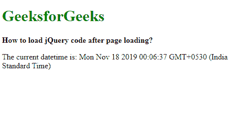
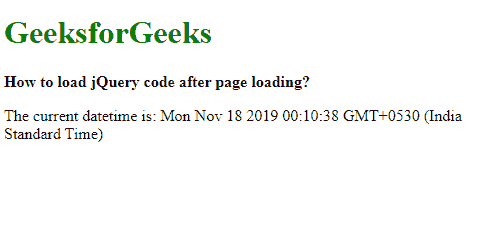

# 加载页面后如何加载 jQuery 代码？

> 原文:[https://www . geesforgeks . org/如何加载-jquery-加载页面后的代码/](https://www.geeksforgeeks.org/how-to-load-jquery-code-after-loading-the-page/)

**方法 1:对加载事件使用 on()方法:**jQuery 中的 **on()** 方法用于将任何事件的事件处理程序附加到所选元素。首先使用选择器选择窗口对象，并在此元素上使用 on()方法。
只要整个页面完成加载，包括样式表和图像等其他资源，就会触发“加载”事件。检查此事件是否绕过它到 on()方法。然后可以在该方法的第二个参数中调用要执行的函数。这将在页面完成加载后调用该函数。

**语法:**

```html
$(window).on('load', functionTobeLoaded() )
```

**示例:**

```html
<!DOCTYPE html>
<html>

<head>
    <title>
        How to load jQuery code
        after page loading?
    </title>

    <script src=
        "https://code.jquery.com/jquery-3.3.1.min.js">
    </script>
</head>

<body>
    <h1 style="color: green">
        GeeksforGeeks
    </h1>

    <b>
        How to load jQuery code
        after page loading?
    </b>

    <p>
        The current datetime is:
        <span class="date"></span>
    </p>

    <script type="text/javascript">
        $(window).on('load', showDatetime());

        function showDatetime() {
            document.querySelector(".date").textContent
                    = new Date();
        }
    </script>
</body>

</html>
```

**输出:**页面加载后:


**方法 2:使用 ready()方法:**jQuery 中的 **ready()** 方法用于在 DOM 变得可以安全操作时执行代码。它接受一个可以与需要执行的函数一起传递的处理程序。现在，它将在页面完成加载后调用该函数。

**语法:**

```html
$(document).ready( functionTobeLoaded() )
```

**示例:**

```html
<!DOCTYPE html>
<html>

<head>
    <title>
        How to load jQuery code
        after page loading?
    </title>

    <script src=
        "https://code.jquery.com/jquery-3.3.1.min.js">
    </script>
</head>

<body>
    <h1 style="color: green">
        GeeksforGeeks
    </h1>

    <b>
        How to load jQuery code
        after page loading?
    </b>

    <p>
        The current datetime is:
        <span class="date"></span>
    </p>

    <script type="text/javascript">
        $(document).ready(
            showDatetime()
        );

        function showDatetime() {
        document.querySelector(".date").textContent
                = new Date();
        }
    </script>
</body>

</html>
```

**输出:**页面加载后
