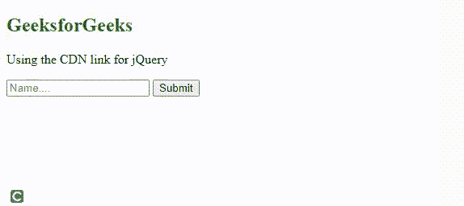
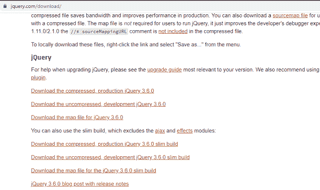
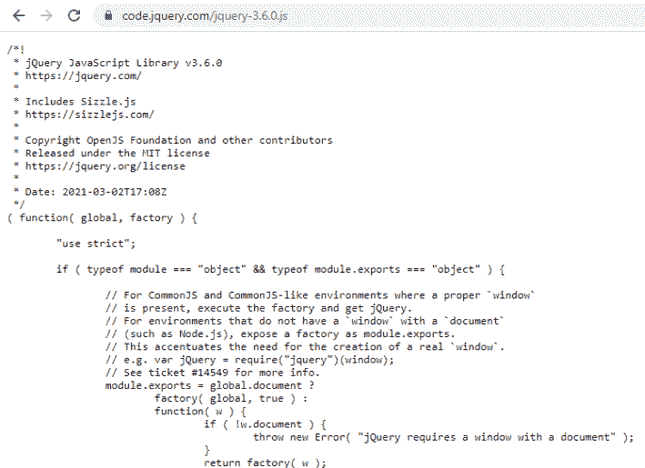
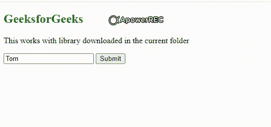

# CDN 不可用的情况下如何加载本地 jQuery 文件？

> 原文:[https://www . geesforgeks . org/如何加载-本地-jquery-案例文件-cdn-不可用/](https://www.geeksforgeeks.org/how-to-load-local-jquery-file-in-case-cdn-is-not-available/)

[jQuery](https://www.geeksforgeeks.org/jquery-introduction/) 是一个轻量级的、“少写多做”的 JavaScript 库。jQuery 有助于尽可能简单地编写 JavaScript。将 JavaScript 中的几行代码转换成一行代码是有效的。它还简化了像 Ajax 调用和 DOM(文档对象模型)这样的任务。

jQuery 库包含以下功能:

*   HTML/DOM 操作
*   CSS 操作
*   HTML 事件方法
*   效果和动画
*   创建交互式、快速动态网页应用的网页开发技术
*   公用事业

有许多方法可以在应用程序中使用 jQuery，其中一种比其他方法更容易。下面是一些可以用来加载本地 jquery 文件的方法。

**方法 1:使用 jQuery CDN(内容交付网络)**

**示例:**在本例中，我们将只在脚本标签中包含 CDN 行，如果您单击提交按钮，您将在浏览器中看到您的姓名显示为提醒。

## 超文本标记语言

```html
<!DOCTYPE html>
<html>

<head>
    <!--Script loaded from Google CDN service-->
    <script src=
"https://ajax.googleapis.com/ajax/libs/jquery/3.5.1/jquery.min.js">
    </script>
</head>

<body>
    <h2 style="color:green">GeeksforGeeks</h2>

    <p>Using the CDN link for jQuery</p>

    <input type="text" placeholder="Name...." id="name">
    <button id="btn">Submit</button>

    <script>
        $("#btn").click(function (event) {

            // If you click the submit button 
            // you will see your name coming
            // up as alert in the browser
            event.preventDefault();
            var name = $("#name").val();
            alert(name);
        });
    </script>
</body>

</html>
```

**输出:**



带 CDN 链接

现在我们将看到如何加载本地 jquery 文件，以防上面的 CDN 不可用。

**方法二:下载 jQuery 在本地使用。**

从[这里](https://jquery.com/download/)下载 jQuery 库。有两个版本的 jQuery 可以下载。

*   **制作版:**这是给你的直播网站的，因为已经缩小压缩了
*   **开发版本:**这是为了测试和开发(未压缩和可读的代码)



从本页下载 jquery 库链接

*   下载的文件将是一个单一的 JavaScript 文件，您可以参考，如图所示。保存在当前文件夹中时，将其重命名，并在包含库文件时在标题部分包含相同的名称。



**示例:**在本例中，我们将下载库文件**“**jquery . min . js”，如果您单击提交按钮，您将在浏览器中看到您的名字作为警报出现。

## 超文本标记语言

```html
<!DOCTYPE html>
<html>

<head>
    <script type="text/javascript" src=
"http://ajax.googleapis.com/ajax/libs/jquery/1.5.1/jquery.min.js">
    </script>

    <!--In case cdn fails, local will load up for sure-->
    <script>
        window.jQuery || document.write(
            '<script src="jquery.min.js">\x3C/script>'
        )
    </script>
    <!--'\x3C' has been used so that the script 
        does not end prematurely. The above 
        condition checks whether local has 
        loaded if not then it loads up the 
        local -->
</head>

<body>
    <h2 style="color:green">GeeksforGeeks</h2>

    <p>
        This works with library downloaded 
        in the current folder
    </p>

    <input type="text" placeholder="Name...." id="name">
    <button id="btn">Submit</button>

    <script>
        $("#btn").click(function (event) {

            // If you click the submit button you 
            // will see your name coming up as 
            // alert in the browser
            event.preventDefault();
            var name = $("#name").val();
            alert(name);
        });
    </script>
</body>

</html>
```

**输出:**



使用下载的 jquery 库

**注意:**脚本标签的源(src)中的路径需要正确配置。它应该设置为正确的路径，以便 jQuery 能够完美地工作。

您也可以使用 npm(节点包安装程序)将 jQuery 安装为节点包。

```html
npm install jquery
```

您也可以使用纱线命令行界面安装它，命令如下。

```html
yarn add jquery
```