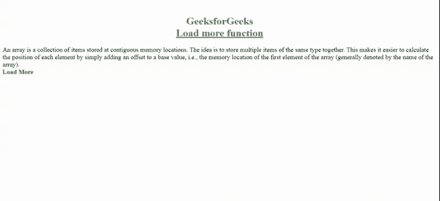

# 如何使用 jQuery 加载更多功能？

> 原文:[https://www . geesforgeks . org/如何使用 jquery 加载更多功能/](https://www.geeksforgeeks.org/how-to-load-more-feature-using-jquery/)

[Bootstrap](https://www.geeksforgeeks.org/bootstrap-tutorials/) 提供了很多有用的功能，我们一般会将其集成到我们的网站中。其中之一是“**加载更多**”功能，我们可以在每秒访问的网站上看到该功能。“加载更多”功能用于向访问者加载或显示网页上的更多可用内容。最初，一半的内容是隐藏的，只有一部分对访问者是可见的。当点击“加载更多”按钮时，剩余的内容就会出现。这个特性也给网站一个干净的外观。这是一个非常酷的功能，你必须在你的网站上尝试。

**方法:**bootstrap 的 **Load More** 特性可以通过在代码中包含一个特定的脚本(如下所示)和一些 javascript 库来集成到网站上。该**脚本**根据**切片**功能，将特定类别对应的所有元素分割成大小不同的部分，点击屏幕上的加载更多按钮，显示不同的部分。当大小变为零时，也就是说，没有更多的元素了，它会显示文本“没有更多可查看的”。

让我们看看如何将**加载更多**功能逐步集成到网站中的分步实现。

**第一步:**你只需要在你的网站上包含以下脚本，就可以让“加载更多”按钮工作。这里，**。块**是 HTML 代码中项目的类，我们将在其上应用加载更多功能，**#加载**是加载更多按钮的 id。

```html
<script >
    $(document).ready(function() {
        $(".block").slice(0, 2).show();
        if ($(".block:hidden").length != 0) {
            $("#load").show();
        }
        $("#load").on("click", function(e) {
            e.preventDefault();
            $(".block:hidden").slice(0, 2).slideDown();
            if ($(".block:hidden").length == 0) {
                $("#load").text("No More to view").fadOut("slow");
            }
        });
    }) 
</script> 
```

**步骤 2:** 还需要在你的 HTML 文件中包含以下 javascript 库作为脚本。

> <src = " https://cdnjs . cloudflare . com/Ajax/libs/jquery ui/1 . 12 . 1/jquery-ui . min . js "></script>

**示例:**

## 超文本标记语言

```html
<!DOCTYPE html>
<html>

<head>
    <title>
        Load more function Example:2
    </title>

    <script src=
"https://cdnjs.cloudflare.com/ajax/libs/jquery/3.2.1/jquery.min.js">
    </script>

    <script src=
"https://cdnjs.cloudflare.com/ajax/libs/jqueryui/1.12.1/jquery-ui.min.js">
    </script>

    <style>
        h1 {
            color: #3C8E3D;
        }

        .block {
            display: none;
            font-size: 20px;
        }

        #load {
            font-size: 20px;
            color: green;
        }
    </style>
</head>

<body>
    <h1 align="center">
        <b> GeeksforGeeks <br>
            <u>Load more function</u>
        </b>
    </h1>

    <div class="container">
        <div class="block">
            An array is a collection of items stored
            at contiguous memory locations.The idea 
            is to store multiple items of the same 
            type together. This makes it easier to 
            calculate the position of each element 
            by simply adding an offset to a base 
            value, i.e., the memory location of the 
            first element of the array (generally 
            denoted by the name of the array).
        </div>

        <div class="block">
            The base value is index 0 and the 
            difference between the two indexes is 
            the offset. For simplicity, we can
            think of an array as a fleet of stairs 
            where on each step is placed a value 
            (let’s say one of your friends). Here, 
            you can identify the location of any of 
            your friends by simply knowing the count 
            of the step they are on.
        </div>

        <div class="block">
            In C language, array has a fixed size 
            meaning once the size is given to it, 
            it cannot be changed i.e. you can’t
            shrink it neither can you expand it. 
            The reason was that for expanding, if 
            we change the size we can’t be sure
            ( it’s not possible every time) that we 
            get the next memory location to us as free.
        </div>

        <div class="block"> <br>
            Types of indexing in an array: <br>
            0 (zero-based indexing) <br>
            1 (one-based indexing) <br>
            n (n-based indexing)
        </div>
    </div>
    <div id="load"> <b> Load More </b></div>

    <script>
        $(document).ready(function () {
            $(".block").slice(0, 1).show();
            if ($(".block:hidden").length != 0) {
                $("#load").show();
            }
            $("#load").on("click", function (e) {
                e.preventDefault();
                $(".block:hidden").slice(0, 1).slideDown();
                if ($(".block:hidden").length == 0) {
                    $("#load").text("No More to view")
                        .fadOut("slow");
                }
            });
        })
    </script>
</body>

</html>
```

**输出:**



**说明:**在本例中，最初在输出中只能看到一个段落，每次点击**加载** **更多按钮**，就会出现一个连续的段落，这是因为在**切片功能**中，我们这次提到了 **(0，1)** 。