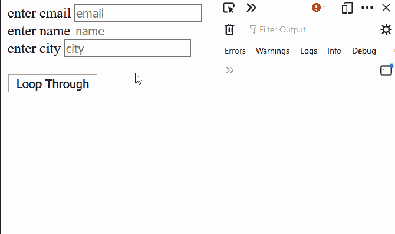
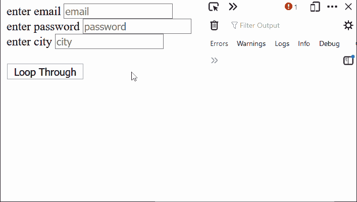

# 如何在 jQuery 中循环遍历输入元素？

> 原文:[https://www . geesforgeks . org/如何在 jquery 中循环输入元素/](https://www.geeksforgeeks.org/how-to-loop-through-input-elements-in-jquery/)

在本文中，我们将学习如何循环输入元素并在 jQuery 中显示它们的当前值。这可以通过两种方法实现:

**方法 1:** 在该方法中，我们将通过使用*输入【类型=文本】*作为选择器来迭代文本类型的每个输入类型。接下来，我们将使用 **[(每个)](https://www.geeksforgeeks.org/jquery-misc-each-method/)** 方法来迭代输入以显示值或根据需要执行任何操作。

**语法:**

```html
$("#id input[type=text]").each(function() {
    //... your code
});
```

**示例:**

## 超文本标记语言

```html
<html>
<head>

  <!-- Include jQuery -->
  <script src=
"https://code.jquery.com/jquery-3.6.0.js">
  </script>
  <script>
    $(document).ready(function () {

      // Bind the click event to the function
      $("#buttonId").click(function () {

        // Select all the elements with the
        // type of text
        $("#formId input[type=text]")
            .each(function () {

          // Print the value currently in
          // the input box
          console.log(this.value);
        });
      })
    });
  </script>
</head>
<body>

  <!-- Define the form and the inputs -->
  <form action="" id="formId">
    <label>enter email</label>
    <input type="text"
           placeholder="email"><br>
    <label>enter name</label>
    <input type="text"
           placeholder="name"><br>
    <label>enter city</label>
    <input type="text"
           placeholder="city"><br><br>
    <button type="button" 
            id="buttonId">
      Loop Through
    </button>
  </form>
</body>
</html>
```

**输出:**



**方法 2:** 在这种方法中，我们将尝试迭代所有可能的输入类型。我们将使用表单 id 选择表单，并使用 jQuery 中的 **[过滤器()](https://www.geeksforgeeks.org/jquery-filter/)** 方法迭代每个输入类型。可以通过在 jQuery 中指定 **[:input](https://www.geeksforgeeks.org/jquery-input-selector/)** 选择器来过滤输入，该选择器选择它所使用的元素上的每种类型的输入。接下来，我们将使用 **each()** 方法迭代输入以显示值或根据需要执行任何操作。

**语法:**

```html
$('#id *').filter(':input').each(function () {
     //..your code
});
```

**示例:**

## 超文本标记语言

```html
<html>
<head>

  <!-- Include jQuery -->
  <script src=
"https://code.jquery.com/jquery-3.6.0.js">
  </script>
  <script>
    $(document).ready(function () {

      // Bind the click event to the function
      $("#buttonId").click(function () {

        // Select all the elements
        // which is of the type of input
        $('#formId *').filter(':input')
                        .each(function () {

        // Print the value currently in
        // the input element
          console.log($(this).val());
        });
      })
    })
  </script>
</head>
<body>

  <!-- Define the form and the inputs -->
  <form action="" id="formId">
    <label>enter email</label>
    <input type="email"
           placeholder="email"><br>
    <label>enter password</label>
    <input type="password" 
           placeholder="password"><br>
    <label>enter city</label>
    <input type="text" 
           placeholder="city">
    <br><br>
    <button type="button" 
            id="buttonId">
      Loop Through
    </button>
  </form>
</body>
</html>
```

**输出:**

