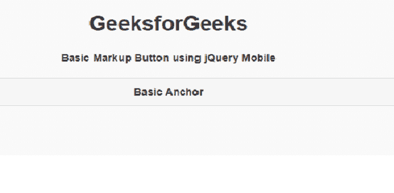
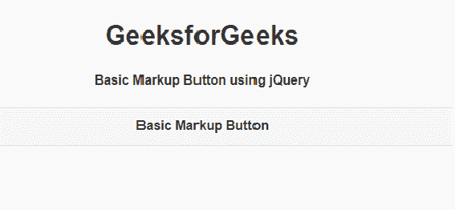
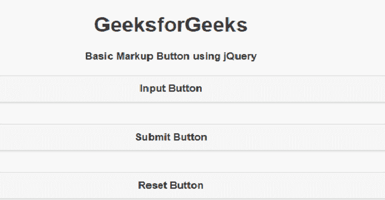

# 如何使用 jQuery Mobile 制作基本标记按钮？

> 原文:[https://www . geeksforgeeks . org/how-make-a-basic-markup-button-use-jquery-mobile/](https://www.geeksforgeeks.org/how-to-make-a-basic-markup-button-using-jquery-mobile/)

**jQuery Mobile** 是一种基于网络的技术，用于制作可在所有智能手机、平板电脑和台式机上访问的响应内容。

在本文中，我们将使用 **jQuery Mobile** 创建一个基本的标记按钮。

**进场:**

*   添加项目所需的 jQuery 移动脚本。

    > <link rel="”stylesheet”" href="”http://code.jquery.com/mobile/1.4.5/jquery.mobile-1.4.5.min.css”">
    > <脚本 src = " http://code。jquery。com/jquery-1。11 .1 .量滴 js " > < /脚本>
    > <脚本 src = " http://code。jquery。com/mobile/1。4 .5/jquery。移动一号。4 .5 .量滴 js " > < /脚本>

*   我们将使用不同类型的 *ui* 类和不同类型来组成标记按钮。

**示例 1:** 我们将使用带有*class = " ui-BTN ui-corner-all "*的锚标签来创建按钮。

## 超文本标记语言

```html
<!DOCTYPE html> 
<html> 

<head>
    <link rel="stylesheet" 
        href="http://code.jquery.com/mobile/
        1.4.5/jquery.mobile-1.4.5.min.css" />
    <script 
        src="http://code.jquery.com/jquery-1.11.1.min.js">
    </script>
    <script 
        src="http://code.jquery.com/mobile/
        1.4.5/jquery.mobile-1.4.5.min.js">
    </script>
</head>

<body> 
    <center>
        <h1>GeeksforGeeks</h1>
        <h4>Basic Markup Button using jQuery Mobile</h4>
    </center>
    <a href="https://www.geeksforgeeks.org" 
       class="ui-btn ui-corner-all" target="_">
      Basic Anchor
    </a>
</body> 

</html> 
```

**输出:**



**示例 2:** 我们将使用带有*类的*按钮*进行标记。*

## 超文本标记语言

```html
<!DOCTYPE html> 
<html> 

<head>
    <link rel="stylesheet" 
        href="http://code.jquery.com/mobile/
        1.4.5/jquery.mobile-1.4.5.min.css" />
    <script 
        src="http://code.jquery.com/jquery-1.11.1.min.js">
    </script>
    <script 
        src="http://code.jquery.com/mobile/
        1.4.5/jquery.mobile-1.4.5.min.js">
    </script>
</head>

<body> 
    <center>
        <h1>GeeksforGeeks</h1>
        <h4>Basic Markup Button using jQuery</h4>
    </center>

    <button class="ui-btn ui-corner-all">
    Basic Markup Button
    </button>
</body> 

</html> 
```

**输出:**



**示例 3:** 在本例中，我们将使用不同的输入类型来创建按钮。

## 超文本标记语言

```html
<!DOCTYPE html> 
<html> 

<head>
    <link rel="stylesheet" 
        href="http://code.jquery.com/mobile/1.4.5/
       jquery.mobile-1.4.5.min.css" />
    <script 
        src="http://code.jquery.com/jquery-1.11.1.min.js">
    </script>
    <script 
        src="http://code.jquery.com/mobile/1.4.5/jquery.mobile-1.4.5.min.js">
    </script>
</head>

<body> 
    <center>
        <h1>GeeksforGeeks</h1>
        <h4>Basic Markup Button using jQuery</h4>
    </center>
    <input type="button" value="Input Button">
    <input type="submit" value="Submit Button">
    <input type="reset" value="Reset Button">
</body> 

</html> 
```

**输出:**

