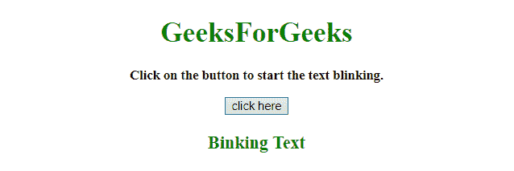
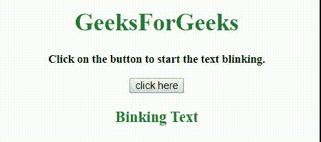

# 如何用 jQuery 做一个闪烁的文字？

> 原文:[https://www . geeksforgeeks . org/如何使用-jquery 制作闪烁的文本/](https://www.geeksforgeeks.org/how-to-make-a-blinking-text-using-jquery/)

给定一个 HTML 文档，任务是使用 jQuery 闪烁元素的特定文本。下面讨论的解决这个问题的技术很少:

**方法 1:**

*   从文档中选择特定元素。
*   在特定时间段后，将其**可见性属性**从**隐藏切换到可见**，反之亦然。

**示例 1:** 该示例实现了上述方法。

```html
<!DOCTYPE HTML>  
<html>  

<head>  
    <title>  
        How to make a blinking text using jQuery ?
    </title>

    <script src=
"https://ajax.googleapis.com/ajax/libs/jquery/3.4.1/jquery.min.js">
    </script>
</head>  

<body align = "center">  

    <h1 style = "color:green;" >  
        GeeksForGeeks  
    </h1> 

    <p id = "GFG_UP" style = 
            "font-size: 15px; font-weight: bold;"> 
    </p>

    <button onclick = "GFG_Fun()">
        click here
    </button>

    <p id = "GFG_DOWN" style = 
        "font-size: 20px; font-weight: bold; color:green;"> 
    </p>

    <script>  
        var el_up = document.getElementById('GFG_UP');
        var el_down = document.getElementById('GFG_DOWN');

        el_up.innerHTML = "Click on the button to start "
                        + "the text blinking.";
        el_down.innerHTML = "Binking Text";

        function GFG_Fun() {
            $('#GFG_DOWN').each(function() {
                var elem = $(this);
                setInterval(function() {
                    if (elem.css('visibility') == 'hidden') {
                        elem.css('visibility', 'visible');
                    } else {
                        elem.css('visibility', 'hidden');
                    }    
                }, 100);
            });
        }
    </script>  
</body>  

</html>
```

**输出:**

*   **点击按钮前:**
    
*   **点击按钮后:**
    

**方法 2:**

*   从文档中选择特定元素。
*   在特定时间段后，将其**不透明度属性**从 **0 设置为**，反之亦然。

**示例 2:** 该示例实现了上述方法。

```html
<!DOCTYPE HTML>  
<html>  

<head>  
    <title>  
        How to make a blinking text using jQuery ?
    </title>

    <script src=
"https://ajax.googleapis.com/ajax/libs/jquery/3.4.1/jquery.min.js">
    </script>
</head>  

<body align = "center">  

    <h1 style = "color:green;" >  
        GeeksForGeeks  
    </h1> 

    <p id = "GFG_UP" style = 
            "font-size: 15px; font-weight: bold;"> 
    </p>

    <button onclick = "GFG_Fun()">
        click here
    </button>

    <p id = "GFG_DOWN" style = 
        "font-size: 20px; font-weight: bold; color:green;"> 
    </p>

    <script>  
        var el_up = document.getElementById('GFG_UP');
        var el_down = document.getElementById('GFG_DOWN');
        el_up.innerHTML = "Click on the button to start "
                        + "the text blinking.";
        el_down.innerHTML = "Binking Text";

        function blink(selector) {
            $(selector).animate({opacity:0}, 50, "linear", 
            function() {
                $(this).delay(100);
                $(this).animate({opacity:1}, 50, function(){
                    blink(this);
                });
                $(this).delay(100);
            });
        }

        function GFG_Fun() {
            blink('#GFG_DOWN');
        }
    </script>  
</body>  

</html>
```

**输出:**

*   **点击按钮前:**
    
*   **点击按钮后:**
    