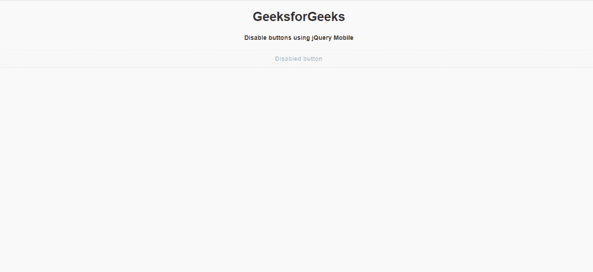
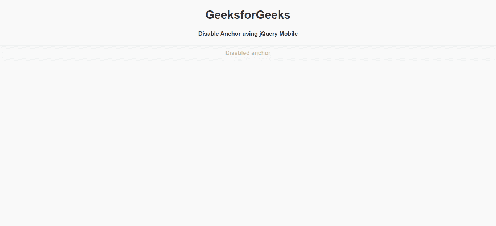

# 如何使用 jQuery Mobile 制作禁用按钮？

> 原文:[https://www . geeksforgeeks . org/如何使用-jquery-mobile/](https://www.geeksforgeeks.org/how-to-make-a-disable-buttons-using-jquery-mobile/) 制作禁用按钮

jQuery Mobile 是一种基于网络的技术，用于制作可在所有智能手机、平板电脑和台式机上访问的响应内容。在本文中，我们将使用 jQuery Mobile 制作一个禁用按钮。

**方法:**首先，添加项目所需的 jQuery Mobile 脚本。

> <link rel="”stylesheet”" href="”http://code.jquery.com/mobile/1.4.5/jquery.mobile-1.4.5.min.css”">

我们将使用不同类型的 ui 类和类型来组成标记按钮。

**示例 1:** 在本文中，我们将使用带有 disabled 属性的 Button 来禁用它

## 超文本标记语言

```html
<!DOCTYPE html> 
<html> 

<head>
    <link rel="stylesheet" href=
"http://code.jquery.com/mobile/1.4.5/jquery.mobile-1.4.5.min.css" />
    <script src=
"http://code.jquery.com/jquery-1.11.1.min.js">
    </script>
    <script src=
"http://code.jquery.com/mobile/1.4.5/jquery.mobile-1.4.5.min.js">
    </script>
</head>

<body> 
    <center>
        <h1>GeeksforGeeks</h1>
        <h4>Disable buttons using jQuery Mobile</h4>
    </center>

    <button disabled="">Disabled button</button>
</body> 

</html> 
```

**输出:**



**示例 2:** 在本文中，我们将使用带有 class="ui-btn ui-state-disabled "的 Anchor 标记来实现我们的目的。

## 超文本标记语言

```html
<!DOCTYPE html> 
<html> 

<head>
    <link rel="stylesheet" href=
"http://code.jquery.com/mobile/1.4.5/jquery.mobile-1.4.5.min.css" />
    <script src=
"http://code.jquery.com/jquery-1.11.1.min.js">
    </script>
    <script src=
"http://code.jquery.com/mobile/1.4.5/jquery.mobile-1.4.5.min.js">
    </script>
</head>

<body> 
    <center>
        <h1>GeeksforGeeks</h1>
        <h4>Disable Anchor using jQuery Mobile</h4>
    </center>

    <a href="https://www.geeksforgeeks.org/" 
           class="ui-btn ui-state-disabled">
          Disabled anchor
      </a>
</body> 

</html>
```

**输出:**

