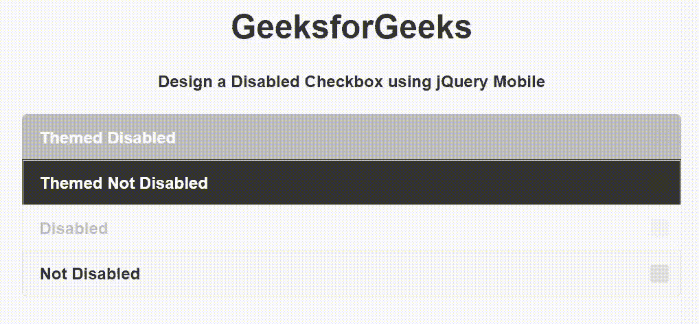

# 如何使用 jQuery Mobile 制作禁用复选框？

> 原文:[https://www . geeksforgeeks . org/如何禁用复选框-使用-jquery-mobile/](https://www.geeksforgeeks.org/how-to-make-a-disabled-checkbox-using-jquery-mobile/)

jQuery Mobile 是一种基于网络的技术，用于制作可在所有智能手机、平板电脑和台式机上访问的响应内容。在本文中，我们将使用 jQuery Mobile 创建一个禁用的复选框。

**方法:**添加项目所需的 jQuery Mobile 脚本。

> <link rel="”stylesheet”" href="”http://code.jquery.com/mobile/1.4.5/jquery.mobile-1.4.5.min.css”">

**示例:**我们将使用 jQuery Mobile 创建一个禁用的复选框。我们使用 input type="checkbox "属性创建复选框，并使用 disabled="disabled "属性禁用复选框。

## 超文本标记语言

```html
<!DOCTYPE html>
<html>

<head>
    <link rel="stylesheet" href=
"http://code.jquery.com/mobile/1.4.5/jquery.mobile-1.4.5.min.css" />

    <script src="http://code.jquery.com/jquery-1.11.1.min.js">
    </script>

    <script src=
"http://code.jquery.com/mobile/1.4.5/jquery.mobile-1.4.5.min.js">
    </script>
</head>

<body>
    <center>
        <h1>GeeksforGeeks</h1>

        <h4>
            Design a Disabled Checkbox
            using jQuery Mobile
        </h4>

        <form style="width: 50%;">
            <fieldset data-role="controlgroup" 
                data-iconpos="right">

                <input type="checkbox" disabled="" 
                    name="groupcheckbox1" 
                    id="groupcheckbox1" data-theme="b">
                <label for="groupcheckbox1">
                    Themed Disabled
                </label>

                <input type="checkbox" name="groupcheckbox2" 
                    id="groupcheckbox2" data-theme="b">
                <label for="groupcheckbox2">
                    Themed Not Disabled
                </label>

                <input type="checkbox" disabled="" 
                    name="groupcheckbox3" id="groupcheckbox3">
                <label for="groupcheckbox3">Disabled</label>

                <input type="checkbox" name="groupcheckbox4" 
                    id="groupcheckbox4">
                <label for="groupcheckbox4">Not Disabled</label>
            </fieldset>
        </form>
    </center>
</body>

</html>
```

**输出:**

