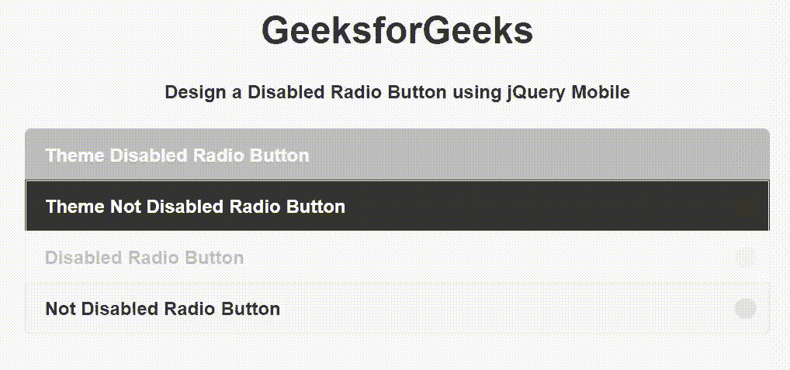

# 如何使用 jQuery Mobile 制作禁用单选按钮？

> 原文:[https://www . geeksforgeeks . org/如何使用-jquery-mobile/](https://www.geeksforgeeks.org/how-to-make-a-disabled-radio-button-using-jquery-mobile/) 禁用单选按钮

jQuery Mobile 是一种基于网络的技术，用于制作可在所有智能手机、平板电脑和台式机上访问的响应内容。

在本文中，我们将使用 jQuery Mobile 创建一个禁用的单选按钮。

**进场:**

*   添加项目所需的 jQuery 移动脚本。

> 【rel= "样式表"链接 href = " http://code . jquery . com/mobile/1 . 4 . 5/jquery . mobile-1 . 4 . 5 . min . CSS "/>t1]
> 
> *<脚本 src = " http://code . jquery . com/jquery-1 . 11 . 1 . min . js "></脚本>* 
> 
> *<脚本 src = " http://code . jquery . com/mobile/1 . 4 . 5/jquery . mobile-1 . 4 . 5 . min . js "></脚本>*

**示例:**我们将使用 jQuery Mobile 创建一个禁用单选按钮。我们使用输入 *type="radio"* 属性创建单选按钮，并使用 *disabled="disabled"* 属性禁用单选按钮。

## 超文本标记语言

```
<!DOCTYPE html>
<html>

<head>
    <link rel="stylesheet" href=
   "http://code.jquery.com/mobile/1.4.5/jquery.mobile-1.4.5.min.css" />

    <script src="http://code.jquery.com/jquery-1.11.1.min.js">
    </script>

    <script src=
    "http://code.jquery.com/mobile/1.4.5/jquery.mobile-1.4.5.min.js">
    </script>
</head>

<body>
    <center>
        <h1>GeeksforGeeks</h1>

        <h4>
            Design a Disabled Radio Button
            using jQuery Mobile
        </h4>

        <form style="width: 50%;">
            <fieldset data-role="controlgroup" 
                data-iconpos="right">

                <label for="radioButton">
                    Theme Disabled Radio Button
                </label>
                <input type="radio" name="radioButton" 
                    id="radioButton" class="custom" data-theme="b"
                    disabled="disabled">

                <label for="radioButton1">
                    Theme Not Disabled Radio Button
                </label>
                <input type="radio" name="radioButton" 
                    id="radioButton1" data-theme="b" 
                    class="custom">

                <label for="radioButton2">
                    Disabled Radio Button
                </label>
                <input type="radio" name="radioButton" 
                    id="radioButton2" class="custom" 
                    disabled="disabled">

                <label for="radioButton3">
                    Not Disabled Radio Button
                </label>
                <input type="radio" name="radioButton" 
                    id="radioButton3" class="custom">
            </fieldset>
        </form>
    </center>
</body>

</html>
```

```
Output:
```

