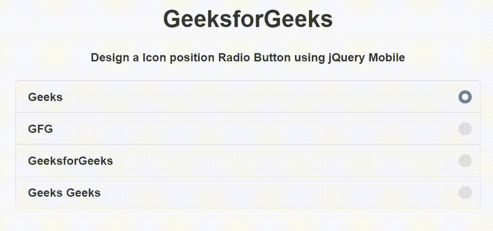

# 如何使用 jQuery Mobile 制作图标位置单选按钮？

> 原文:[https://www . geesforgeks . org/如何制作图标-位置-单选按钮-使用-使用-jquery-mobile/](https://www.geeksforgeeks.org/how-to-make-a-icon-position-radio-button-using-using-jquery-mobile/)

jQuery Mobile 是一种基于网络的技术，用于制作可在所有智能手机、平板电脑和台式机上访问的响应内容。在本文中，我们将使用 jQuery Mobile 创建一个图标位置单选按钮。

**方法:**添加项目所需的 jQuery Mobile 脚本。

> <link rel="”stylesheet”" href="”http://code.jquery.com/mobile/1.4.5/jquery.mobile-1.4.5.min.css”">

**示例:**我们将使用 jQuery Mobile 创建一个图标位置单选按钮。我们使用 input type="radio "属性创建单选按钮，并使用 data-iconpos="right "属性定位图标单选按钮。

## 超文本标记语言

```
<!DOCTYPE html>
<html>

<head>
    <link rel="stylesheet" href=
"http://code.jquery.com/mobile/1.4.5/jquery.mobile-1.4.5.min.css" />

    <script src="http://code.jquery.com/jquery-1.11.1.min.js">
    </script>

    <script src=
"http://code.jquery.com/mobile/1.4.5/jquery.mobile-1.4.5.min.js">
    </script>
</head>

<body>
    <center>
        <h1>GeeksforGeeks</h1>

        <h4>
            Design a Icon position Radio
            Button using jQuery Mobile
        </h4>

        <form style="width: 50%;">
            <fieldset data-role="controlgroup" 
                data-iconpos="right">
                <label for="radioButton">Geeks</label>
                <input type="radio" name="radioButton" 
                    id="radioButton" class="custom" checked>

                <label for="radioButton1">GFG</label>
                <input type="radio" name="radioButton" 
                    id="radioButton1" class="custom">

                <label for="radioButton2">GeeksforGeeks</label>
                <input type="radio" name="radioButton" 
                    id="radioButton2" class="custom">

                <label for="radioButton3">Geeks Geeks</label>
                <input type="radio" name="radioButton"
                    id="radioButton3" class="custom">
            </fieldset>
        </form>
    </center>
</body>

</html>
```

**输出:**

