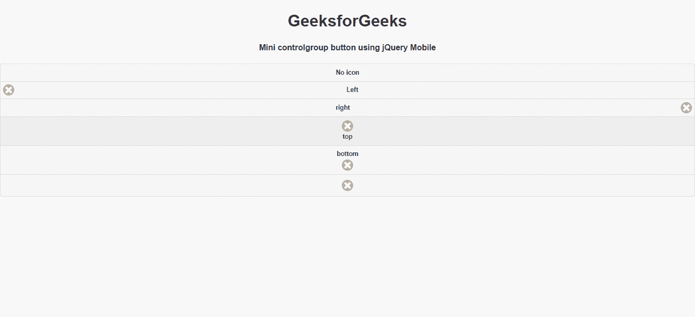

# 如何使用 jQuery Mobile 制作迷你大小的垂直控件组？

> 原文:[https://www . geeksforgeeks . org/如何制作小型垂直控件组-使用-jquery-mobile/](https://www.geeksforgeeks.org/how-to-make-a-mini-sized-vertical-controlgroups-using-jquery-mobile/)

jQuery Mobile 是一种基于网络的技术，用于制作可在所有智能手机、平板电脑和台式机上访问的响应内容。在本文中，我们将使用 jQuery Mobile 制作一个迷你大小的垂直控件组。

**进场:**

*   首先，添加项目所需的 jQuery Mobile 脚本。

    > <link rel="”stylesheet”" href="”http://code.jquery.com/mobile/1.4.5/jquery.mobile-1.4.5.min.css”">
    > <脚本 src = " http://code。jquery。com/jquery-1。11 .1 .量滴 js " > < /脚本>
    > <脚本 src = " http://code。jquery。com/mobile/1。4 .5/jquery。移动一号。4 .5 .量滴 js " > < /脚本>

**示例 1:** 在本例中，我们将使用 Button 对按钮进行分组。

## 超文本标记语言

```html
<!DOCTYPE html>
<html>

<head>
    <link rel="stylesheet" href=
"http://code.jquery.com/mobile/1.4.5/jquery.mobile-1.4.5.min.css" />

    <script src=
        "http://code.jquery.com/jquery-1.11.1.min.js">
    </script>

    <script src=
"http://code.jquery.com/mobile/1.4.5/jquery.mobile-1.4.5.min.js">
    </script>
</head>

<body>
    <center>
        <h1>GeeksforGeeks</h1>

        <h4>
            Mini controlgroup button 
            using jQuery Mobile
        </h4>
    </center>

    <div data-role="controlgroup">
        <button data-role="button" 
            data-mini="true">No icon
        </button>

        <button data-role="button" data-icon="delete" 
            data-mini="true" data-iconpos="left" 
            id="gfg">Left
        </button>

        <button data-role="button" data-icon="delete" 
            data-mini="true" data-iconpos="right" 
            id="gfg">right
        </button>

        <button data-role="button" data-icon="delete" 
            data-mini="true" data-iconpos="top" 
            id="gfg">top
        </button>

        <button data-role="button" data-icon="delete" 
            data-mini="true" data-iconpos="bottom" 
            id="gfg">bottom
        </button>

        <button data-role="button" data-icon="delete" 
            data-mini="true" data-iconpos="notext"
            id="gfg">icon only
        </button>
    </div>
</body>

</html>
```

**输出:**



**示例 2:** 在本例中，我们将使用 Anchor 对按钮进行分组。

## 超文本标记语言

```html
<!DOCTYPE html>
<html>

<head>
    <link rel="stylesheet" href=
"http://code.jquery.com/mobile/1.4.5/jquery.mobile-1.4.5.min.css" />

    <script src=
        "http://code.jquery.com/jquery-1.11.1.min.js">
    </script>

    <script src=
"http://code.jquery.com/mobile/1.4.5/jquery.mobile-1.4.5.min.js">
    </script>
</head>

<body>
    <center>
        <h1>GeeksforGeeks</h1>

        <h4>
            Mini controlgroup anchor 
            using jQuery Mobile
        </h4>
    </center>

    <div data-role="controlgroup">
        <a href="https://www.geeksforgeeks.org/" 
            data-role="button" data-mini="true">
            No icon
        </a>

        <a href="https://www.geeksforgeeks.org/" 
            data-role="button" data-icon="delete" 
            data-mini="true" data-iconpos="left">
            Left
        </a>

        <a href="https://www.geeksforgeeks.org/" 
            data-role="button" data-icon="delete"
            data-mini="true" data-iconpos="right">
            right
        </a>

        <a href="https://www.geeksforgeeks.org/" 
            data-role="button" data-icon="delete" 
            data-mini="true" data-iconpos="top">
            top
        </a>

        <a href="https://www.geeksforgeeks.org/" 
            data-role="button" data-icon="delete" 
            data-mini="true" data-iconpos="bottom">
            bottom
        </a>

        <a href="https://www.geeksforgeeks.org/" 
            data-role="button" data-icon="delete"
            data-mini="true" data-iconpos="notext">
            icon only
        </a>
    </div>
</body>

</html>
```

**输出:**

