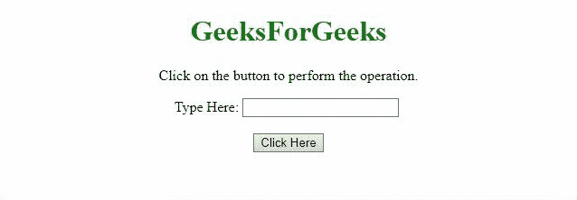

# 如何使用 jQuery 使文本输入不可编辑？

> 原文:[https://www . geesforgeks . org/如何制作文本-输入-不可编辑-使用-jquery/](https://www.geeksforgeeks.org/how-to-make-a-text-input-non-editable-using-jquery/)

一个包含输入文本区域的 HTML 文档，任务是在 jQuery 的帮助下使文本输入不可编辑。下面讨论两种方法:

**方法 1:** 我们将属性**只读**设置为**真**。要设置只读属性，我们将使用 [**prop()方法**](https://www.geeksforgeeks.org/jquery-prop-with-examples/) 。

*   **例:**

    ```html
    <!DOCTYPE HTML>
    <html>

    <head>
        <title>
            How to make a text input
            non-editable using JQuery?
        </title>

        <script src=
    "https://ajax.googleapis.com/ajax/libs/jquery/3.4.0/jquery.min.js">
        </script>
    </head>

    <body style="text-align:center;">

        <h1 style="color:green;">
            GeeksForGeeks
        </h1>

        <p id="GFG_UP"></p>

        Type Here: <input id="input" />
        <br><br>

        <button onclick="GFG_Fun()">
            Click Here
        </button>

        <p id="GFG_DOWN"></p>

        <script>
            var el_up = document.getElementById('GFG_UP');
            var el_down = document.getElementById('GFG_DOWN');
            el_up.innerHTML = "Click on the button to "
                            + "perform the operation.";

            function GFG_Fun() {
                $("#input").prop("readonly", true);

                el_down.innerHTML = 
                    "Input element is now read-only";
            }
        </script>
    </body>

    </html>
    ```

*   **输出:**
    

**方法 2:** 我们将属性**只读**设置为**真**。在本例中，我们将使用 [**attr()方法**](https://www.geeksforgeeks.org/jquery-attr-method/) 来设置属性值。

*   **例:**

    ```html
    <!DOCTYPE HTML>
    <html>

    <head>
        <title>
            How to make a text input 
            non-editable using JQuery?
        </title>

        <script src=
    "https://ajax.googleapis.com/ajax/libs/jquery/3.4.0/jquery.min.js">
        </script>
    </head>

    <body style="text-align:center;">

        <h1 style="color:green;">
            GeeksForGeeks
        </h1>

        <p id="GFG_UP"></p>

        Type Here: <input id="input" />
        <br><br>

        <button onclick="GFG_Fun()">
            Click Here
        </button>

        <p id="GFG_DOWN"></p>

        <script>
            var el_up = document.getElementById('GFG_UP');
            var el_down = document.getElementById('GFG_DOWN');
            el_up.innerHTML = "Click on the button to "
                            + "perform the operation.";

            function GFG_Fun() {
                $("#input").attr("readonly", true);
                el_down.innerHTML = 
                    "Input element is now read-only";
            }
        </script>
    </body>

    </html>
    ```

*   **输出:**
    