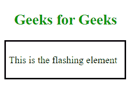
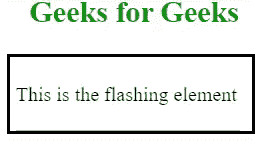
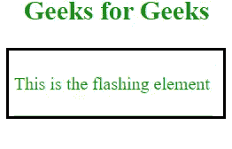

# 如何在 jQuery 中让一个元素“闪”起来？

> 原文:[https://www . geeksforgeeks . org/如何在 jquery 中制作元素闪存/](https://www.geeksforgeeks.org/how-to-make-an-element-flash-in-jquery/)

在本文中，我们将使用 jQuery 创建闪烁元素。下面讨论两种方法。

我们将使用 CDN 链接来包含 jQuery 内容。jQuery 的 CDN 链接必须添加到 HTML 文档中。

> https://code.jquery.com/

我们将使用 HTML5 和 CSS3 来创建文档的结构，并添加所需的元素。

*   **HTML 代码:**我们将在带有黑色边框的 div 元素中添加一些虚拟文本。随后，我们将使这段文字闪光。

    ```html
    <!DOCTYPE html>
    <html lang="en">

    <head>
        <meta charset="UTF-8">
        <meta name="viewport" content="width=device-width,
               initial-scale=1.0">
        <title>Document</title>
        <link rel="stylesheet" href="style.css">
        <script src=
    "https://code.jquery.com/jquery-3.4.1.min.js"
            integrity=
    "sha256-CSXorXvZcTkaix6Yvo6HppcZGetbYMGWSFlBw8HfCJo=" 
            crossorigin="anonymous">
            </script>
    </head>

    <body>
        <h2 class="header">Geeks for Geeks</h2>
        <div class="element">
            <p class="text flash1">
                This is the flashing element</p>
        </div>
    </body>

    </html>
    ```

*   **CSS Code:** Let us design the elements using CSS to make the page attractive.

    **CSS 代码:**

    ```html
    <style>
        .header {
            margin-left: 18px;
            color: rgb(0, 153, 0);
        }

        .element {
            border: 2px solid black;
            width: 12vw;
            padding: 5px;
        }
    </style>
    ```

*   **输出:**
    

**方法 1:使用 fadeIn()和 fadeOut()方法:**在这种方法中，我们将在元素上设置连续的 fadeIn()和 fadeOut()方法，然后设置一个间隔，以确保闪烁无限期地继续。

```html
$(document).ready(() => {
    setInterval(() => {
        $('p').fadeIn();
        $('p').fadeOut();
    }, 500);
});
```

**示例:**

```html
<!DOCTYPE html>
<html lang="en">

<head>
    <meta charset="UTF-8">
    <meta name="viewport" content="width=device-width, 
      initial-scale=1.0">

    <title>
        How to make an element
        "flash" in jQuery?
    </title>

    <script src=
"https://code.jquery.com/jquery-3.4.1.min.js"
        integrity=
"sha256-CSXorXvZcTkaix6Yvo6HppcZGetbYMGWSFlBw8HfCJo="
        crossorigin="anonymous">
    </script>

    <style>
        .header {
            margin-left: 18px;
            color: rgb(0, 153, 0);
        }

        .element {
            border: 2px solid black;
            width: 12vw;
            padding: 5px;
        }
    </style>
</head>

<body>
    <h2 class="header">Geeks for Geeks</h2>
    <div class="element">
        <p class="text flash1">
            This is the flashing element
        </p>
    </div>

    <script>
        $(document).ready(() => {
            const lheight = $('.element').height();
            setInterval(() => {
                $('p').fadeIn();
                $('p').fadeOut();

                // The following code keeps the 
                // height of the div intact
                if ($('.element').height() !== 0) {
                    $('.element').css('height', `${lheight}px`);
                }
            }, 500);
        });
    </script>
</body>

</html>
```

**输出:**


**方法二:使用 toggleClass()方法:**我们将使用方法来更改不同设计的 CSS 类。因此，元素看起来会是闪光的。

让我们添加所需的 CSS 类:

```html
<style>
    .header {
        color: rgb(0, 153, 0);
    }

    .element {
        border: 2px solid black;
        width: 12vw;
        padding: 5px;
    }

    .flash1 {
        color: black;
    }

    .flash2 {
        color: rgb(0, 153, 0);
    }
</style>
```

下面的 JavaScript 将帮助我们使文本元素以不同的颜色闪烁:

```html
$(document).ready(() => {
    setInterval(() => {
        switch ($("p").attr("class")) {
            case "text flash1":
                $("p").toggleClass("flash1 flash2");
                break;

            case "text flash2":
                $("p").toggleClass("flash2 flash1");
        }
    }, 500);
});
```

**示例:**

```html
<!DOCTYPE html>
<html lang="en">

<head>
    <meta charset="UTF-8">
    <meta name="viewport" content=
        "width=device-width,initial-scale=1.0">

    <script src=
"https://code.jquery.com/jquery-3.4.1.min.js"
        integrity=
"sha256-CSXorXvZcTkaix6Yvo6HppcZGetbYMGWSFlBw8HfCJo="
        crossorigin="anonymous">
    </script>

    <title>
        How to make an element
        "flash" in jQuery?
    </title>

    <style>
        .header {
            margin-left: 16px;
            color: rgb(0, 153, 0);
        }

        .element {
            border: 2px solid black;
            width: 12vw;
            padding: 5px;
        }

        .flash1 {
            color: black;
        }

        .flash2 {
            color: rgb(0, 153, 0);
        }
    </style>
</head>

<body>
    <h2 class="header">Geeks for Geeks</h2>
    <div class="element">
        <p class="text flash1">
            This is the flashing element
        </p>
    </div>

    <script>
        $(document).ready(() => {
            setInterval(() => {
                switch ($("p").attr("class")) {
                    case "text flash1":
                        $("p").toggleClass("flash1 flash2");
                        break;
                    case "text flash2":
                        $("p").toggleClass("flash2 flash1");
                }
            }, 500);
        });
    </script>
</body>

</html>
```

**输出:**
