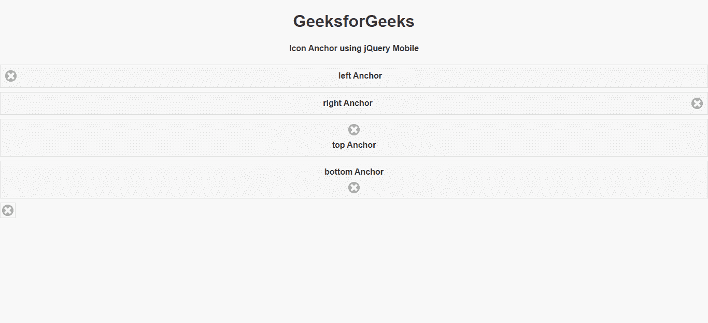
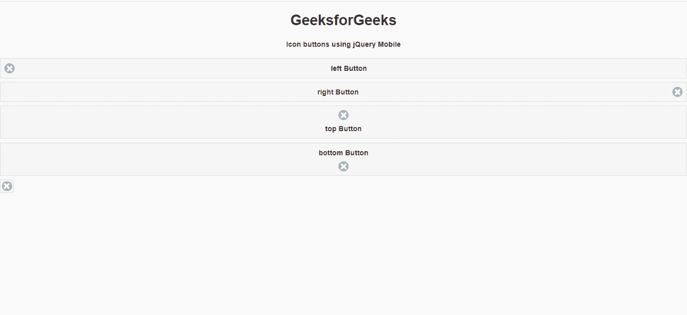

# 如何使用 jQuery Mobile 制作图标位置按钮？

> 原文:[https://www . geesforgeks . org/如何制作图标-位置-按钮-使用-jquery-mobile/](https://www.geeksforgeeks.org/how-to-make-an-icon-position-button-using-jquery-mobile/)

jQuery Mobile 是一种基于网络的技术，用于制作可在所有智能手机、平板电脑和台式机上访问的响应内容。在本文中，我们将使用 jQuery Mobile 制作一个图标位置按钮。

**进场:**

*   首先，添加项目所需的 jQuery Mobile 脚本。

    > <link rel="”stylesheet”" href="”http://code.jquery.com/mobile/1.4.5/jquery.mobile-1.4.5.min.css”">
    > <脚本 src = " http://code。jquery。com/jquery-1。11 .1 .量滴 js " > < /脚本>
    > <脚本 src = " http://code。jquery。com/mobile/1。4 .5/jquery。移动一号。4 .5 .量滴 js " > < /脚本>

*   我们将使用不同类型的 ui 类和类型来组成标记按钮。

**示例 1:** 在这个示例中，我们将使用不同类的 Anchor 来制作按钮。

## 超文本标记语言

```html
<!DOCTYPE html>
<html>

<head>
    <link rel="stylesheet" href=
"http://code.jquery.com/mobile/1.4.5/jquery.mobile-1.4.5.min.css" />

    <script src=
        "http://code.jquery.com/jquery-1.11.1.min.js">
    </script>

    <script src=
"http://code.jquery.com/mobile/1.4.5/jquery.mobile-1.4.5.min.js">
    </script>
</head>

<body>
    <center>
        <h1>GeeksforGeeks</h1>

        <h4>Icon Anchor using jQuery Mobile</h4>
    </center>

    <a href="https://www.geeksforgeeks.org/" 
        class="ui-btn ui-icon-delete ui-btn-icon-left">
        left Anchor
    </a>

    <a href="https://www.geeksforgeeks.org/" 
        class="ui-btn ui-icon-delete ui-btn-icon-right">
        right Anchor
    </a>

    <a href="https://www.geeksforgeeks.org/" 
        class="ui-btn ui-icon-delete ui-btn-icon-top">
        top Anchor
    </a>

    <a href="https://www.geeksforgeeks.org/" 
        class="ui-btn ui-icon-delete ui-btn-icon-bottom">
        bottom Anchor
    </a>

    <a href="https://www.geeksforgeeks.org/" 
        class="ui-btn ui-icon-delete ui-btn-icon-notext">
        icon only Anchor
    </a>
</body>

</html>
```

**输出:**



**示例 2:** 在这个示例中，我们将使用具有不同类的按钮标签来实现我们的目的。

## 超文本标记语言

```html
<!DOCTYPE html>
<html>

<head>
    <link rel="stylesheet" href=
"http://code.jquery.com/mobile/1.4.5/jquery.mobile-1.4.5.min.css"/>

    <script src=
        "http://code.jquery.com/jquery-1.11.1.min.js">
    </script>

    <script src=
"http://code.jquery.com/mobile/1.4.5/jquery.mobile-1.4.5.min.js">
    </script>
</head>

<body>
    <center>
        <h1>GeeksforGeeks</h1>
        <h4>Icon buttons using jQuery Mobile</h4>
    </center>

    <button class="ui-btn ui-icon-delete 
        ui-btn-icon-left" id="gfg">
        left Button
    </button>

    <button class="ui-btn ui-icon-delete 
        ui-btn-icon-right" id="gfg">
        right Button
    </button>

    <button class="ui-btn ui-icon-delete 
        ui-btn-icon-top" id="gfg">
        top Button
    </button>

    <button class="ui-btn ui-icon-delete 
        ui-btn-icon-bottom" id="gfg">
        bottom Button
    </button>

    <button class="ui-btn ui-icon-delete 
        ui-btn-icon-notext" id="gfg">
        icon only Button
    </button>
</body>

</html> 
```

**输出:**

