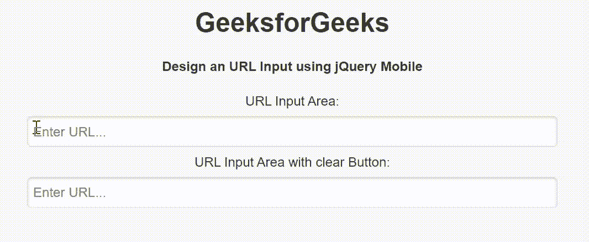

# 如何使用 jQuery Mobile 进行网址输入？

> 原文:[https://www . geesforgeks . org/如何使用-jquery-mobile/](https://www.geeksforgeeks.org/how-to-make-an-url-input-using-jquery-mobile/) 制作网址输入

jQuery Mobile 是一种基于网络的技术，用于制作可在所有智能手机、平板电脑和台式机上访问的响应内容。在本文中，我们将使用 jQuery Mobile 创建一个网址输入。

**方法:**添加项目所需的 jQuery Mobile 脚本。

> <link rel="”stylesheet”" href="”http://code.jquery.com/mobile/1.4.5/jquery.mobile-1.4.5.min.css”">
> <脚本 src = " http://code . jquery . com/jquery-1 . 11 . 1 . min . js "></脚本>
> <脚本 src = " http://code . jquery . com/mobile/1 . 4 . 5/jquery . mobile-1 . 4 . 5 . min . js "></脚本>

**示例:**我们将使用 jQuery Mobile 创建一个 URL 输入区域。我们使用 type="url "属性来设置 url。

## 超文本标记语言

```html
<!DOCTYPE html>
<html>

<head>
    <link rel="stylesheet" href=
"http://code.jquery.com/mobile/1.4.5/jquery.mobile-1.4.5.min.css" />

    <script src=
        "http://code.jquery.com/jquery-1.11.1.min.js">
    </script>

    <script src=
"http://code.jquery.com/mobile/1.4.5/jquery.mobile-1.4.5.min.js">
    </script>
</head>

<body>
    <center>
        <h1>GeeksforGeeks</h1>

        <h4>
            Design an URL Input using jQuery Mobile
        </h4>

        <form style="width: 50%;">
            <label for="URLInput1">
                URL Input Area:
            </label>
            <input type="url" data-clear-btn="false" 
                name="URLInput1" id="URLInput1" 
                value="" placeholder="Enter URL...">

            <label for="URLInput2">
                URL Input Area with clear Button:
            </label>
            <input type="url" data-clear-btn="true" 
                name="URLInput2" id="URLInput2" 
                value="" placeholder="Enter URL...">
        </form>
    </center>
</body>

</html>
```

**输出:**

