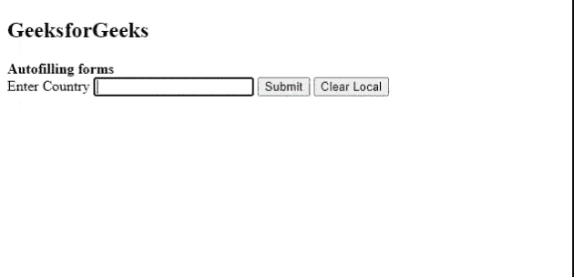
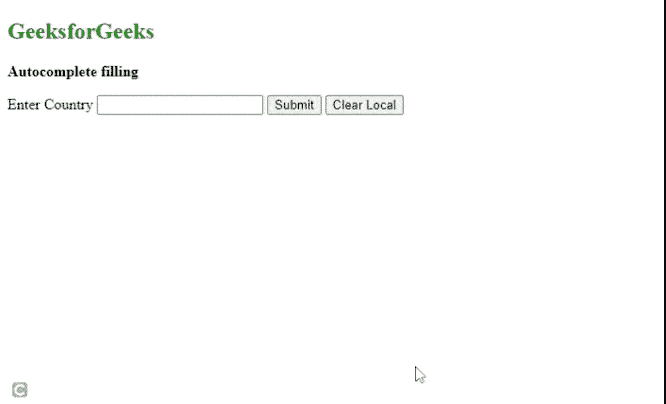

# 如何用 jQuery 和 Web 存储 API 制作自动填表？

> 原文:[https://www . geeksforgeeks . org/如何使用 jquery 和 web 存储 api 自动填写表单/](https://www.geeksforgeeks.org/how-to-make-auto-filling-forms-with-jquery-and-web-storage-api/)

网络存储应用编程接口提供了浏览器存储键/值对的机制，比使用 cookies 更直观。Web Storage 中的两种机制是 [sessionStorage 和 localStorage](https://www.geeksforgeeks.org/localstorage-and-sessionstorage-web-storage-apis/) ，session 只存储一个会话的数据，直到浏览器关闭，本地存储也做同样的事情，但是即使浏览器关闭并重新打开也仍然存在，因此建议使用本地存储来自动填充表单。

现在开发人员有两种可能的方法来创建自动填充表单。

1.  使用本地存储的固定数据
2.  使用动态存储的数据

**注意:**动态存储的数据是根据用户的输入(如表单提交)不时更新的数据。

**方法 1:** 使用[**window . local storage . setitem(key，value)**](https://www.geeksforgeeks.org/html-dom-window-localstorage-properties/) 将数据本地存储在浏览器上，然后在脚本标签中提取数据并用于自动填写表单。

**示例:**让我们假设输入字段为“国家”的情况，需要使用 HTML i localStorage 属性自动填充国家字段。下面的代码实现以给定的形式获取并自动完成国家字段。

## 超文本标记语言

```html
<!DOCTYPE html>
<html lang="en">

<head>
    <script src=
        "https://code.jquery.com/jquery-1.10.2.js">
    </script>
    <script src=
"https://code.jquery.com/ui/1.11.4/jquery-ui.js">
    </script>

    <script>

        // Ready function runs everytime the page load
        $(document).ready(function() {

            // Set local storage      
            var Countries = [
                "Afghanistan", "Albania", "Algeria",
                "Armenia", "Australia", "Bahrain", 
                "Bangladesh", "Belgium", "Bhutan", 
                "Brazil", "Canada", "Chile", "China", 
                "Denmark", "Djibouti", "Egypt", 
                "Estonia", "Ethiopia", "Finland", 
                "France", "Germany", "Ghana", "Greece",
                "Greenland", "Hong Kong", "Hungary", 
                "Iceland", "India", "Indonesia", "Iran",
                "Iraq", "Ireland", "Israel", "Italy", 
                "Japan", "Jersey", "Jordan", "Kazakhstan",
                "Kuwait", "Kyrgyzstan", "Lebanon", 
                "Malaysia", "Maldives", "Mexico", "Nepal", 
                "Netherlands", "New Zealand", "North Korea",
                "Pakistan", "Palestine", "Philippines", 
                "Poland", "Qatar", "Russia", "Saudi Arabia",
                "Singapore", "South Africa", "Swaziland", 
                "Taiwan", "Thailand", "Turkey", 
                "United Kingdom", "United States of America",
                "Uruguay", "Vietnam", "Yemen", "Zimbabwe"
            ];

            // Fetch locally stored Countries
            var Countries = window.localStorage.getItem("Countries");

            // Convert it to a javascript object
            Countries = JSON.parse(Countries);

            // Fetch Country input tag and use JQuery 
            // autocomplete function
            $("#country_input").autocomplete({

                // Pass javascript object to 
                // autocomplete function
                source: Countries,
                autofocus: true,
            });

            // To clear local storage when clear
            // button is clicked 
            $("#clear").click(function(event) {
                localStorage.clear();
            });
        });
    </script>
</head>

<body>
    <h2>GeeksforGeeks</h2>
    <b>Autofilling forms </b>

    <form name="form" id="form">
        <label for="">Enter Country</label>
        <input type="text" id="country_input" 
                name="country_input" />
        <button type="submit">Submit</button>
        <button id="clear">Clear Local</button>
    </form>
</body>

</html>
```

**输出:**这种方法的一个缺点是需要一次在本地存储各种数据，这会消耗内存，并且这些数据中的大部分可能永远不会被使用。在这种情况下，动态存储数据有助于频繁存储值，从而减少内存和无法预定义值的情况。



自动填充功能

**方法 2:** 在这种方法中，开发人员在本地存储输入表单字段数据，并为每次表单提交更新本地存储的值。在此过程中，会检查重复条目，并且只存储一次。开发人员可以选择本地存储中应该存在的值的数量。

**示例:**

## 超文本标记语言

```html
<!DOCTYPE html>
<html lang="en">

<head>
    <script src="https://code.jquery.com/jquery-1.10.2.js">
    </script>
    <script src="https://code.jquery.com/ui/1.11.4/jquery-ui.js">
    </script>

    <script>
        // This function runs everytime the page load
        $(document).ready(function() {

            var Countries = [
                "Afghanistan", "Albania", "Algeria",
                "Armenia", "Australia", "Bahrain", 
                "Bangladesh", "Belgium", "Bhutan", 
                "Brazil", "Canada", "Chile", "China", 
                "Denmark", "Djibouti", "Egypt", 
                "Estonia", "Ethiopia", "Finland", 
                "France", "Germany", "Ghana", "Greece",
                "Greenland", "Hong Kong", "Hungary", 
                "Iceland", "India", "Indonesia", "Iran",
                "Iraq", "Ireland", "Israel", "Italy", 
                "Japan", "Jersey", "Jordan", "Kazakhstan",
                "Kuwait", "Kyrgyzstan", "Lebanon", 
                "Malaysia", "Maldives", "Mexico", "Nepal", 
                "Netherlands", "New Zealand", "North Korea",
                "Pakistan", "Palestine", "Philippines", 
                "Poland", "Qatar", "Russia", "Saudi Arabia",
                "Singapore", "South Africa", "Swaziland", 
                "Taiwan", "Thailand", "Turkey", 
                "United Kingdom", "United States of America",
                "Uruguay", "Vietnam", "Yemen", "Zimbabwe"
            ];

            // Fetch locally stored Countries
            var Countries = window.localStorage.getItem("Countries");

            // If countries is not available assign empty array []
            // else assign JavaScript object
            Countries = Countries === null ? [] : JSON.parse(Countries);

            // Fetch Country input tag and use jQuery 
            // autocomplete function
            $("#country_input").autocomplete({

                // Pass JavaScript object to 
                // autocomplete function
                source: Countries,
                autofocus: true,
            });

            // Form submission event function
            $("form").submit(function(event) {

                // Prevent form submission until
                // code execution
                event.preventDefault;

                // Fetch input field value
                var currentCountry = $("#country_input").val();

                // Store it on the top of the Countries
                // array at index 0
                Countries.unshift(currentCountry);

                // Remove the duplicate entries
                for (var i = 1; i < Countries.length; i++) {

                    // Countries[0] stores current input field
                    if (Countries[0] === Countries[i]) {
                        Countries.splice(i, 1);
                    }
                }

                // Stores only the last 10 searches
                // Developer can choose the number of 
                // entries to be stored          
                if (i === Countries.length && Countries.length > 10) {
                    Countries.pop();
                }

                // Stores the new list into the local 
                // storage overwriting the previous one
                window.localStorage.setItem("Countries", 
                    JSON.stringify(Countries));

                // Submit the form
                event.submit;
            });

            // To clear local storage when clear
            // button is clicked
            $("#clear").click(function(event) {
                localStorage.clear();
            });
        });
    </script>
</head>

<body>
    <h2 style="color:green">GeeksforGeeks</h2>
    <b>Autocomplete filling</b>

    <p></p>

    <form name="form" id="form">
        <label for="">Enter Country</label>
        <input type="text" id="country_input" 
                name="country_input" />
        <button type="submit">Submit</button>
        <button id="clear">Clear Local</button>
    </form>
</body>

</html>
```

**输出:**



自动完成