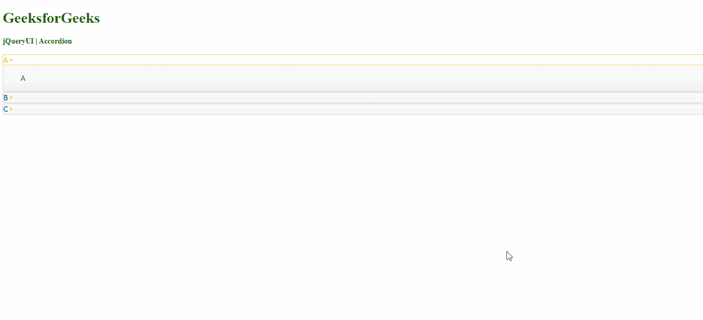
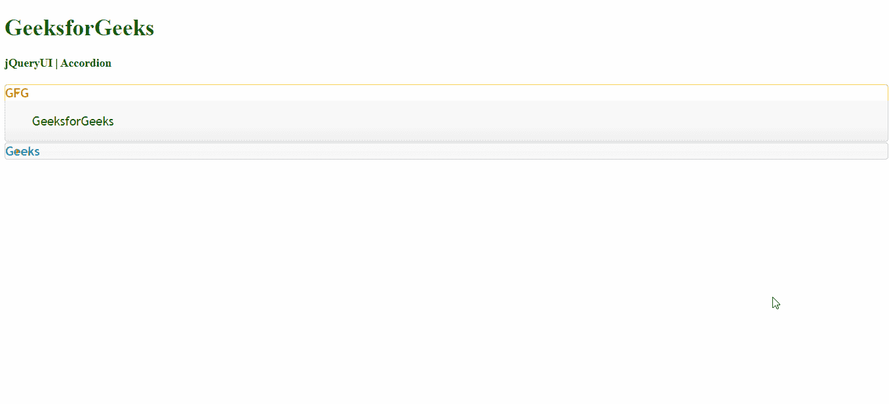

# 如何使用 jQuery Mobile 制作 Basic 手风琴？

> 原文:[https://www . geeksforgeeks . org/如何制作-基本-手风琴-使用-jquery-mobile/](https://www.geeksforgeeks.org/how-to-make-basic-accordion-using-jquery-mobile/)

在本文中，我们将使用 jQuery Mobile 制作一个基本的手风琴。

**方法:**首先，添加项目所需的 jQuery Mobile 脚本。

> <src 脚本= " https://Ajax . Google APIs . com/Ajax/libs/jquery ui/1 . 8 . 16/jquery-ui . js "></script><link href = " http://Ajax . Google APIs . com/Ajax

**例 1:**

## 超文本标记语言

```html
<!DOCTYPE html> 
<html> 

<head> 
    <meta charset="utf-8"> 
    <meta name="viewport" content= 
        "width=device-width, initial-scale=1"> 

    <script src= 
"https://ajax.googleapis.com/ajax/libs/jquery/1.7.1/jquery.js"> 
    </script> 

    <script src= 
"https://ajax.googleapis.com/ajax/libs/jqueryui/1.8.16/jquery-ui.js"> 
    </script> 

    <link href= 
"http://ajax.googleapis.com/ajax/libs/jqueryui/1.8.16/themes/ui-lightness/jquery-ui.css"
        rel="stylesheet" type="text/css" /> 

    <style> 
        .height { 
            height: 10px; 
        } 
    </style> 

    <script> 
        $(function () { 
            $( "#gfg" ).accordion();
        }); 
    </script> 
    <style>
         #gfg{font-size: 17px;}
    </style>
</head> 

<body> 
    <h1 style="color:green">GeeksforGeeks</h1> 
    <b>jQueryUI | Accordion</b> 
    <br>
    <br>
    <div id="gfg">
        <h3>A</h3>
        <div>A</div>
        <h3>B</h3>
        <div>B</div>
        <h3>C</h3>
        <div>C</div>
    </div> 
</body> 

</html>
```

**输出:**



**例 2:**

## 超文本标记语言

```html
<!DOCTYPE html> 
<html> 

<head> 
    <meta charset="utf-8"> 
    <meta name="viewport" content= 
        "width=device-width, initial-scale=1"> 

    <script src= 
"https://ajax.googleapis.com/ajax/libs/jquery/1.7.1/jquery.js"> 
    </script> 

    <script src= 
"https://ajax.googleapis.com/ajax/libs/jqueryui/1.8.16/jquery-ui.js"> 
    </script> 

    <link href= 
"http://ajax.googleapis.com/ajax/libs/jqueryui/1.8.16/themes/ui-lightness/jquery-ui.css"
        rel="stylesheet" type="text/css" /> 

    <style> 
        .height { 
            height: 10px; 
        } 
    </style> 

    <script> 
        $(function () { 
            $( "#gfg" ).accordion();
        }); 
    </script> 
    <style>
         #gfg{font-size: 17px;}
    </style>
</head> 

<body> 
    <h1 style="color:green">GeeksforGeeks</h1> 
    <b>jQueryUI | Accordion</b> 
    <br>
    <br>
    <div id="gfg">
        <h3>GFG</h3>
        <div>GeeksforGeeks</div>
        <h3>Geeks</h3>
        <div>GeeksforGeeks</div>
    </div> 
</body> 

</html>
```

**输出:**

