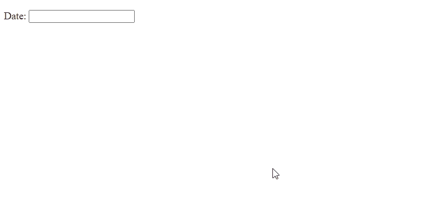

# 如何使用 jQuery UI 制作基本的 Datepicker？

> 原文:[https://www . geesforgeks . org/how-make-basic-date picker-using-jquery-ui/](https://www.geeksforgeeks.org/how-to-make-basic-datepicker-using-jquery-ui/)

在本文中，我们将使用 jQuery 用户界面创建一个基本的**日期选择器**。关于日期选择器的本地化，请参考本[文章](https://www.geeksforgeeks.org/how-to-create-ui-datepicker-using-jquery/)。

**方法:**首先，添加项目所需的 jQuery UI 脚本。

> <src 脚本= " https://Ajax . Google APIs . com/Ajax/libs/jquery ui/1 . 8 . 16/jquery-ui . js "></script><link href = " http://Ajax . Google APIs . com/Ajax

**示例:**

## 超文本标记语言

```html
<!DOCTYPE html>
<html lang="en">

<head>
    <meta charset="utf-8">
    <meta name="viewport" content=
        "width=device-width, initial-scale=1">

    <script src=
"https://ajax.googleapis.com/ajax/libs/jquery/1.7.1/jquery.js">
    </script>

    <script src=
"https://ajax.googleapis.com/ajax/libs/jqueryui/1.8.16/jquery-ui.js">
    </script>

    <link href=
"http://ajax.googleapis.com/ajax/libs/jqueryui/1.8.16/themes/ui-lightness/jquery-ui.css"
        rel="stylesheet" type="text/css" />

    <script>
        $(function () {
            $("#datepicker").datepicker();
        });
    </script>
</head>

<body>
    <p>Date: <input type="text" id="datepicker"></p>
</body>

</html>
```

**输出:**

