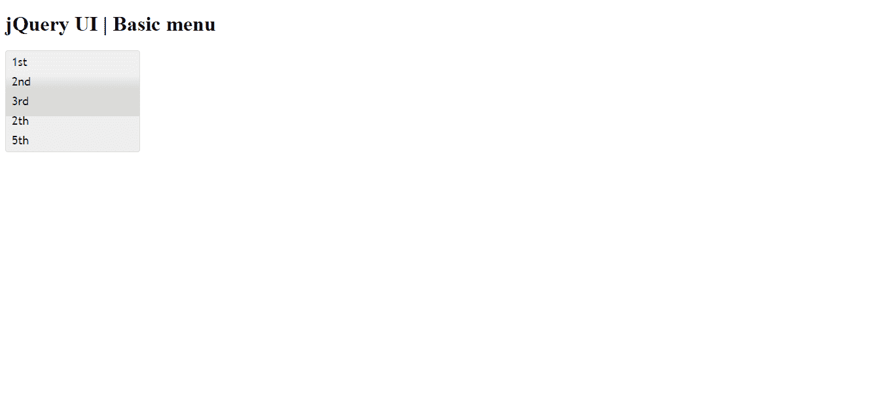

# 如何使用 jQuery UI 制作基础菜单？

> 原文:[https://www . geesforgeks . org/如何制作-基本-菜单-使用-jquery-ui/](https://www.geeksforgeeks.org/how-to-make-basic-menu-using-jquery-ui/)

jQuery UI 由 GUI 小部件、视觉效果和使用 jQuery、CSS 和 HTML 实现的主题组成。jQuery 用户界面非常适合为网页构建用户界面。jQuery UI 菜单是一个 菜单，用于鼠标和键盘交互在页面之间导航*。* 在本文中，我们将展示如何在 jQuery UI 中制作一个基本菜单。

**语法:**

```html
$(".selector").menu( "enable" );
```

**方法:**首先，添加项目所需的 jQuery UI 脚本。

> <link href="“https://code.jquery.com/ui/1.10.4/themes/ui-lightness/jquery-ui.css”" rel="“stylesheet”">

**示例:**

## 超文本标记语言

```html
<!doctype html>
<html lang="en">

<head>
    <meta charset="utf-8">
    <link href=
"https://code.jquery.com/ui/1.10.4/themes/ui-lightness/jquery-ui.css"
    rel="stylesheet">

    <script src="https://code.jquery.com/jquery-1.10.2.js"></script>

    <script src="https://code.jquery.com/ui/1.10.4/jquery-ui.js">
    </script>

    <style>
        .ui-menu {
            width: 200px;
        }
    </style>

    <script>
        $(function() {
            $("#gfg").menu();
            $("#gfg").menu("enable");
        });
    </script>
</head>

<body>
    <h1>jQuery UI | Basic menu </h1>
    <ul id="gfg">
        <li><a href="https://www.geeksforgeeks.org/">
            1st</a>
        </li>

        <li><a href="https://www.geeksforgeeks.org/">
            2nd</a>
        </li>

        <li><a href="https://www.geeksforgeeks.org/">
            3rd</a>
        </li>

        <li><a href="https://www.geeksforgeeks.org/">
            4th</a>
        </li>

        <li><a href="https://www.geeksforgeeks.org/">
            5th</a>
        </li>
    </ul>
</body>

</html>
```

**输出:**

