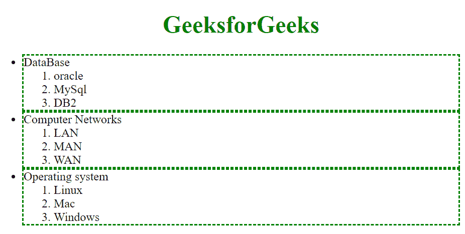

# 如何使用 jQuery 对所有属于指定类的子级的无序列表项做边框？

> 原文:[https://www . geeksforgeeks . org/如何使用-jquery/](https://www.geeksforgeeks.org/how-to-make-border-around-all-unordered-list-items-that-are-children-of-a-specified-class-using-jquery/) 对所有无序列表项目进行边框处理

在本文中，我们将看到如何使用 jQuery 在所有列表项周围设置边框，这些列表项是无序列表的指定类的子级。这个任务可以通过使用子选择器()方法来完成。

**子选择器(“父级>子级”)–**正如您从名称本身注意到的，它需要两个参数，然后执行任务。它选择由“父元素”指定的元素的子元素指定的所有子元素。这里的 ***父*** 是任意选择器，而 ***子*** 是过滤子元素的选择器。

**示例:**在属于< ul class="GFG" >的所有列表项目周围放置边框。

## 超文本标记语言

```
<!doctype html>
<html lang="en">

<head>
    <script src=
"https://code.jquery.com/jquery-3.5.0.js">
    </script>
</head>

<body>

    <ul class="GFG">
        <h1 style="color: green; 
            text-align: center;">
            GeeksforGeeks
        </h1>

        <li>DataBase
            <ol>
                <li>oracle</li>
                <li>MySql</li>
                <li>DB2</li>
            </ol>
        </li>
        <li>Computer Networks
            <ol>
                <li>LAN</li>
                <li>MAN</li>
                <li>WAN</li>
            </ol>
        </li>
        <li>Operating system
            <ol>
                <li>Linux</li>
                <li>Mac</li>
                <li>Windows</li>
            </ol>
        </li>

    </ul>

    <script>
        $("ul.GFG > li")
            .css("border", "2px dashed green");
    </script>

</body>

</html>
```

**输出–**

