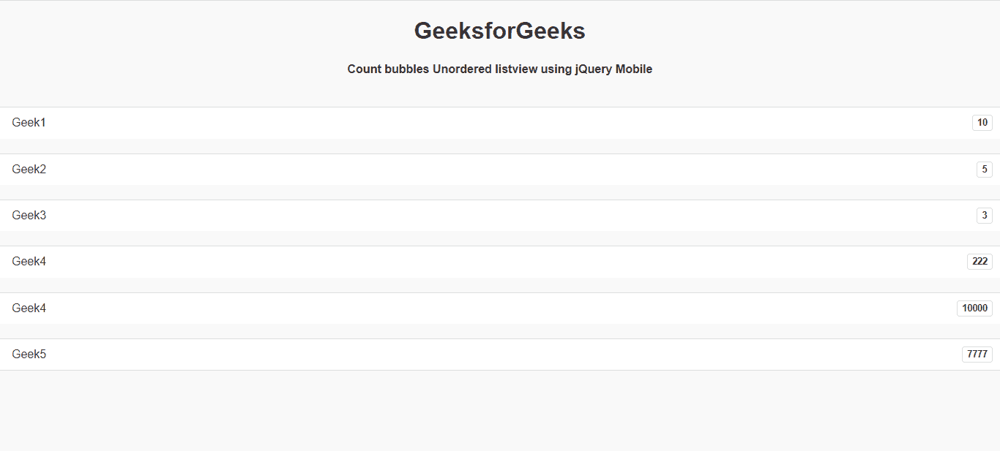

# 如何用 jQuery Mobile 制作计数气泡无序列表视图？

> 原文:[https://www . geesforgeks . org/如何制作-计数-气泡-无序-列表视图-使用-jquery-mobile/](https://www.geeksforgeeks.org/how-to-make-count-bubbles-unordered-listviews-using-jquery-mobile/)

jQuery Mobile 是一种基于网络的技术，用于制作可在所有智能手机、平板电脑和台式机上访问的响应内容。在本文中，我们将使用 jQuery Mobile 制作计数气泡无序列表视图。

**方法:**首先，添加项目所需的 jQuery Mobile 脚本。

> <link rel="”stylesheet”" href="”http://code.jquery.com/mobile/1.4.5/jquery.mobile-1.4.5.min.css”">
> <脚本 src = " http://code . jquery . com/jquery-1 . 11 . 1 . min . js "></脚本>
> <脚本 src = " http://code . jquery . com/mobile/1 . 4 . 5/jquery . mobile-1 . 4 . 5 . min . js "></脚本>

**示例:**

## 超文本标记语言

```html
<!DOCTYPE html>
<html>

<head>
    <link rel="stylesheet" href=
"http://code.jquery.com/mobile/1.4.5/jquery.mobile-1.4.5.min.css" />

    <script src=
        "http://code.jquery.com/jquery-1.11.1.min.js">
    </script>

    <script src=
"http://code.jquery.com/mobile/1.4.5/jquery.mobile-1.4.5.min.js">
    </script>
</head>

<body>
    <center>
        <h1>GeeksforGeeks</h1>

        <h4>
            Count bubbles Unordered listview 
            using jQuery Mobile
        </h4>
    </center>

    <ul data-role="listview" data-count-theme="a">
        <li>Geek1<span class="ui-li-count">10</span></li>
        <li>Geek2<span class="ui-li-count">5</span></li>
        <li>Geek3<span class="ui-li-count">3</span></li>
        <li>Geek4<span class="ui-li-count">222</span></li>
        <li>Geek4<span class="ui-li-count">10000</span></li>
        <li>Geek5<span class="ui-li-count">7777</span></li>
    </ul>
</body>

</html>
```

**输出:**

