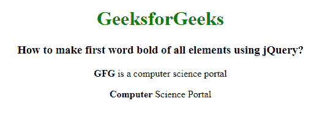

# 如何使用 jQuery 将所有元素的首字加粗？

> 原文:[https://www . geeksforgeeks . org/如何使用-jquery/](https://www.geeksforgeeks.org/how-to-make-first-word-bold-of-all-elements-using-jquery/) 对所有元素进行首字加粗

在本文中，我们将使用 jquery 对所有元素进行首字加粗。为了使第一个单词加粗，我们使用 html()和 text()方法。

**html()方法:**jQuery 中的 html()方法用于设置或返回所选元素的 innerHTML 内容。

**语法:**设置匹配元素的内容。

```html
$(selector).html(content)
```

**text()方法:**此方法用于设置或返回元素的文本内容。设置内容时，它会覆盖所有匹配元素的内容。text 方法()返回的内容用于返回所有匹配元素的文本内容。

**语法:**设置文本内容。

```html
$(selector).text(content)
```

**示例:**

## 超文本标记语言

```html
<!DOCTYPE html>
<html lang="en">

<head>
    <title>
        How to make first word bold
        of all elements using jQuery?
    </title>

    <!-- Import jQuery cdn library -->
    <script src=
"https://ajax.googleapis.com/ajax/libs/jquery/3.3.1/jquery.min.js">
    </script>

    <script>
        $(document).ready(function () {
            $("p").each(function () {
                var txt = $(this);
                txt.html(txt.text()
                .replace(/(^w+)/, '<strong>$1</strong>'));
            });
        });
    </script>
</head>

<body style="text-align: center;">
    <h1 style="color: green;">
        GeeksforGeeks
    </h1>

    <h3>
        How to make first word bold of
        all elements using jQuery?
    </h3>

    <p>GFG is a computer science portal</p>

    <p>Computer Science Portal</p>
</body>

</html>
```

**输出:**

