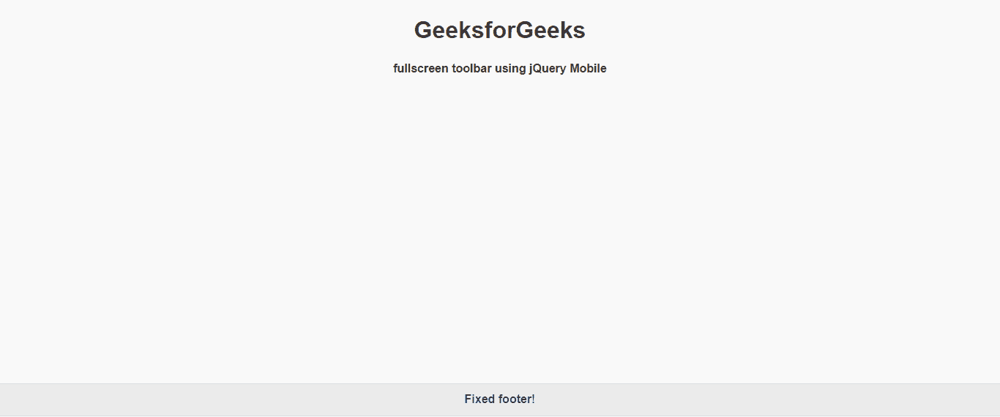
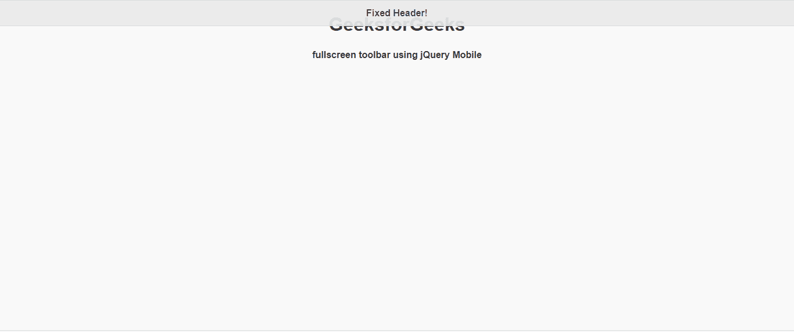

# 如何使用 jQuery Mobile 制作全屏工具栏？

> 原文:[https://www . geesforgeks . org/如何制作-全屏-工具栏-使用-jquery-mobile/](https://www.geeksforgeeks.org/how-to-make-fullscreen-toolbars-using-jquery-mobile/)

jQuery Mobile 是一种基于网络的技术，用于制作可在所有智能手机、平板电脑和台式机上访问的响应内容。在本文中，我们将使用 jQuery Mobile 制作全屏工具栏。

**方法:**首先，添加项目所需的 jQuery Mobile 脚本。

> <link rel="”stylesheet”" href="”http://code.jquery.com/mobile/1.4.5/jquery.mobile-1.4.5.min.css”">

**例 1:**

## 超文本标记语言

```html
<!DOCTYPE html>
<html>

<head>
    <link rel="stylesheet" href=
"http://code.jquery.com/mobile/1.4.5/jquery.mobile-1.4.5.min.css" />

    <script src=
        "http://code.jquery.com/jquery-1.11.1.min.js">
    </script>

    <script src=
"http://code.jquery.com/mobile/1.4.5/jquery.mobile-1.4.5.min.js">
    </script>
</head>

<body>
    <center>
        <h1>GeeksforGeeks</h1>

        <h4>
            fullscreen toolbar using
            jQuery Mobile
        </h4>
    </center>

    <div data-role="footer"
        data-position="fixed"
        data-fullscreen="true">
        <h1>Fixed footer!</h1>
    </div>
</body>

</html>
```

**输出:**



**例 2:**

## 超文本标记语言

```html
<!DOCTYPE html>
<html>

<head>
    <link rel="stylesheet" href=
"http://code.jquery.com/mobile/1.4.5/jquery.mobile-1.4.5.min.css" />

    <script src=
        "http://code.jquery.com/jquery-1.11.1.min.js">
    </script>

    <script src=
"http://code.jquery.com/mobile/1.4.5/jquery.mobile-1.4.5.min.js">
    </script>
</head>

<body>
    <center>
        <h1>GeeksforGeeks</h1>

        <h4>
            fullscreen toolbar using
            jQuery Mobile
        </h4>
    </center>

    <div data-role="header"
        data-position="fixed"
        data-fullscreen="true">

        <h1>Fixed Header!</h1>
    </div>
</body>

</html>
```

**输出:**

