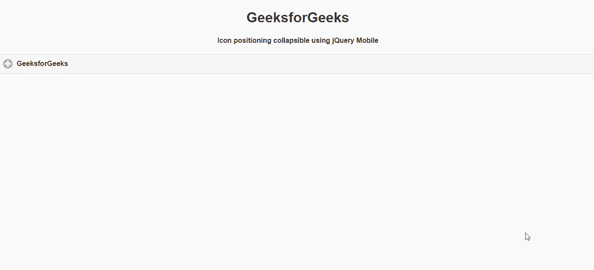

# 如何使用 jQuery Mobile 制作图标定位拼贴？

> 原文:[https://www . geesforgeks . org/如何制作-图标-定位-可折叠-使用-jquery-mobile/](https://www.geeksforgeeks.org/how-to-make-icon-positioning-collapsibles-using-jquery-mobile/)

jQuery Mobile 是一种基于网络的技术，用于制作可在所有智能手机、平板电脑和台式机上访问的响应内容。在本文中，我们将使用 jQuery Mobile 使图标定位可折叠。

**方法:**首先，添加项目所需的 jQuery Mobile 脚本。

> <link rel="”stylesheet”" href="”http://code.jquery.com/mobile/1.4.5/jquery.mobile-1.4.5.min.css”">

**示例:**

## 超文本标记语言

```html
<!DOCTYPE html>
<html>

<head>
    <link rel="stylesheet" href=
"http://code.jquery.com/mobile/1.4.5/jquery.mobile-1.4.5.min.css" />

    <script src=
        "http://code.jquery.com/jquery-1.11.1.min.js">
    </script>

    <script src=
"http://code.jquery.com/mobile/1.4.5/jquery.mobile-1.4.5.min.js">
    </script>
</head>

<body>
    <center>
        <h1>GeeksforGeeks</h1>

        <h4>
            Icon positioning collapsible
            using jQuery Mobile
        </h4>
    </center>

    <div data-role="collapsible" data-iconpos="left">
            <h4>GeeksforGeeks</h4>

        <div data-role="collapsible" data-iconpos="right" />
            <h4>GeeksforGeeks</h4>

        <div data-role="collapsible" data-iconpos="top" />
            <h4>GeeksforGeeks</h4>

        <div data-role="collapsible" data-iconpos="bottom" />
            <h4>GeeksforGeeks</h4>
    </div>
</body>

</html>
```

**输出:**

