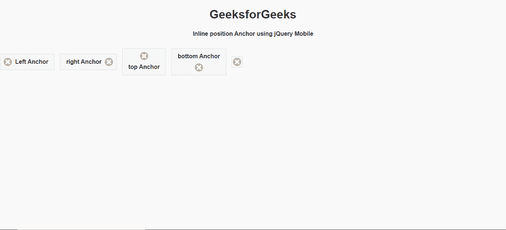
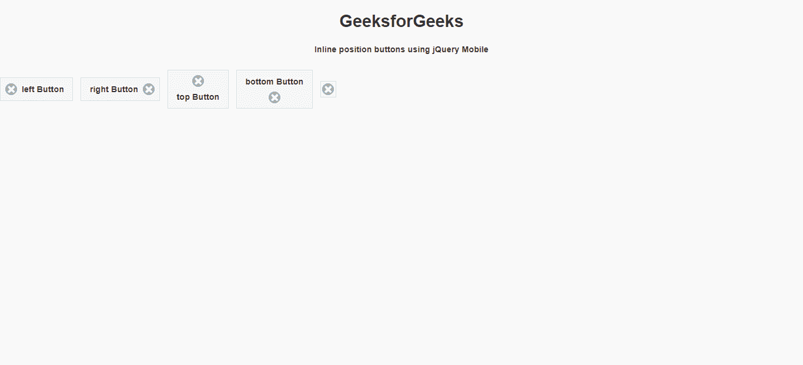

# 如何使用 jQuery Mobile 进行按钮的内联定位？

> 原文:[https://www . geeksforgeeks . org/如何使用-jquery-mobile/](https://www.geeksforgeeks.org/how-to-make-inline-position-of-button-using-jquery-mobile/) 在线制作按钮位置

jQuery Mobile 是一种基于网络的技术，用于制作可在所有智能手机、平板电脑和台式机上访问的响应内容。在本文中，我们将使用 jQuery Mobile 制作一个内嵌位置按钮。

**进场:**

*   首先，添加项目所需的 jQuery Mobile 脚本。

    > <link rel="”stylesheet”" href="”http://code.jquery.com/mobile/1.4.5/jquery.mobile-1.4.5.min.css”">
    > <脚本 src = " http://code。jquery。com/jquery-1。11 .1 .量滴 js " > < /脚本>
    > <脚本 src = " http://code。jquery。com/mobile/1。4 .5/jquery。移动一号。4 .5 .量滴 js " > < /脚本>

*   我们将使用不同类型的 ui 类和类型来组成标记按钮。

**示例 1:** 在这个示例中，我们将使用不同类的 Anchor 来制作按钮。

## 超文本标记语言

```html
<!DOCTYPE html>
<html>

<head>
    <link rel="stylesheet" href=
"http://code.jquery.com/mobile/1.4.5/jquery.mobile-1.4.5.min.css" />

    <script src=
        "http://code.jquery.com/jquery-1.11.1.min.js">
    </script>

    <script src=
"http://code.jquery.com/mobile/1.4.5/jquery.mobile-1.4.5.min.js">
    </script>
</head>

<body>
    <center>
        <h1>GeeksforGeeks</h1>

        <h4>
            Inline position Anchor 
            using jQuery Mobile
        </h4>
    </center>

    <a href="https://www.geeksforgeeks.org/" 
        class="ui-btn ui-btn-inline ui-icon-delete 
        ui-btn-icon-left">
        Left Anchor
    </a>

    <a href="https://www.geeksforgeeks.org/" 
        class="ui-btn ui-btn-inline ui-icon-delete 
        ui-btn-icon-right">
        right Anchor
    </a>

    <a href="https://www.geeksforgeeks.org/" 
        class="ui-btn ui-btn-inline ui-icon-delete 
        ui-btn-icon-top">
        top Anchor
    </a>

    <a href="https://www.geeksforgeeks.org/" 
        class="ui-btn ui-btn-inline ui-icon-delete 
        ui-btn-icon-bottom">
        bottom Anchor
    </a>

    <a href="https://www.geeksforgeeks.org/" 
        class="ui-btn ui-btn-inline ui-icon-delete 
        ui-btn-icon-notext">
        icon only Anchor
    </a>
</body>

</html>
```

**输出:**



**示例 2:** 在这个示例中，我们将使用具有不同类的按钮标签来实现我们的目的。

## 超文本标记语言

```html
<!DOCTYPE html>
<html>

<head>
    <link rel="stylesheet" href=
"http://code.jquery.com/mobile/1.4.5/jquery.mobile-1.4.5.min.css" />

    <script src=
        "http://code.jquery.com/jquery-1.11.1.min.js">
    </script>

    <script src=
"http://code.jquery.com/mobile/1.4.5/jquery.mobile-1.4.5.min.js">
    </script>
</head>

<body>
    <center>
        <h1>GeeksforGeeks</h1>

        <h4>
            Inline position buttons 
            using jQuery Mobile
        </h4>
    </center>

    <button class="ui-btn ui-btn-inline 
        ui-icon-delete ui-btn-icon-left" 
        id="gfg">left Button
    </button>

    <button class="ui-btn ui-btn-inline 
        ui-icon-delete ui-btn-icon-right" 
        id="gfg">right Button
    </button>

    <button class="ui-btn ui-btn-inline 
        ui-icon-delete ui-btn-icon-top" 
        id="gfg">top Button
    </button>

    <button class="ui-btn ui-btn-inline 
        ui-icon-delete ui-btn-icon-bottom" 
        id="gfg">bottom Button
    </button>

    <button class="ui-btn ui-btn-inline 
        ui-icon-delete ui-btn-icon-notext" 
        id="gfg">icon only Button
    </button>
</body>

</html>
```

**输出:**

