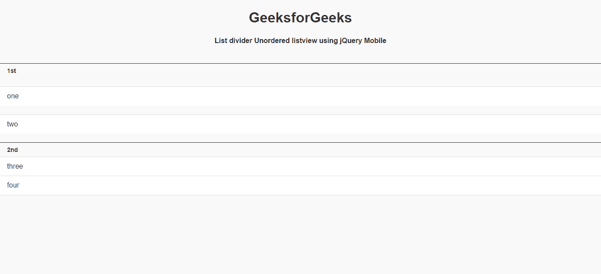

# 如何用 jQuery Mobile 制作列表分割器无序列表视图？

> 原文:[https://www . geesforgeks . org/如何制作列表-分隔符-无序-列表视图-使用-jquery-mobile/](https://www.geeksforgeeks.org/how-to-make-list-divider-unordered-listviews-using-jquery-mobile/)

**jQuery Mobile** 是一种基于网络的技术，用于制作可在所有智能手机、平板电脑和台式机上访问的响应内容。在本文中，我们将使用 **jQuery Mobile** 创建一个无序列表视图的列表分割器。

**方法:**首先，添加项目所需的 jQuery Mobile 脚本。

> <link rel="”stylesheet”" href="”http://code.jquery.com/mobile/1.4.5/jquery.mobile-1.4.5.min.css”/">
> <脚本 src = " http://code . jquery . com/jquery-1 . 11 . 1 . min . js "></脚本>
> <脚本 src = " http://code . jquery . com/mobile/1 . 4 . 5/jquery . mobile-1 . 4 . 5 . min . js "></脚本>

**示例:**

## 超文本标记语言

```html
<!DOCTYPE html>
<html>

<head>
    <link rel="stylesheet" href=
"http://code.jquery.com/mobile/1.4.5/jquery.mobile-1.4.5.min.css" />

    <script src=
        "http://code.jquery.com/jquery-1.11.1.min.js">
    </script>

    <script src=
"http://code.jquery.com/mobile/1.4.5/jquery.mobile-1.4.5.min.js">
    </script>
</head>

<body>
    <center>
        <h1>GeeksforGeeks</h1>

        <h4>
            List divider Unordered listview 
            using jQuery Mobile
        </h4>
    </center>

    <ul data-role="listview" data-divider-theme="d">
        <li data-role="list-divider">1st</li>
        <li>one</li>
        <li>two</li>
        <li data-role="list-divider">2nd</li>
        <li>three</li>
        <li>four</li>
    </ul>
</body>

</html>
```

**输出:**

