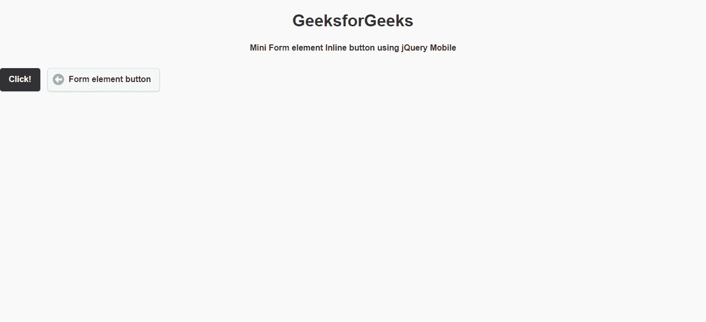

# 如何使用 jQuery Mobile 制作迷你表单元素内联按钮？

> 原文:[https://www . geesforgeks . org/how-make-mini-form-element-inline-button-use-jquery-mobile/](https://www.geeksforgeeks.org/how-to-make-mini-form-element-inline-button-using-jquery-mobile/)

jQuery Mobile 是一种基于网络的技术，用于制作可在所有智能手机、平板电脑和台式机上访问的响应内容。

在本文中，我们将使用 jQuery Mobile 制作迷你表单元素 Inline 按钮。

**方法:**首先，添加项目所需的 jQuery Mobile 脚本。

> <link rel="”stylesheet”" href="”http://code.jquery.com/mobile/1.4.5/jquery.mobile-1.4.5.min.css”/">
> <脚本 src = " http://code . jquery . com/jquery-1 . 11 . 1 . min . js "></脚本>
> <脚本 src = " http://code . jquery . com/mobile/1 . 4 . 5/jquery . mobile-1 . 4 . 5 . min . js "></脚本>

**例 1:**

## 超文本标记语言

```html
<!DOCTYPE html>
<html>

<head>
    <link rel="stylesheet" href=
"http://code.jquery.com/mobile/1.4.5/jquery.mobile-1.4.5.min.css" />

    <script src=
        "http://code.jquery.com/jquery-1.11.1.min.js">
    </script>

    <script src=
"http://code.jquery.com/mobile/1.4.5/jquery.mobile-1.4.5.min.js">
    </script>
</head>

<body>
    <center>
        <h1>GeeksforGeeks</h1>

        <h4>
            Mini Form element Inline 
            button using jQuery Mobile
        </h4>
    </center>

    <a href="https://www.geeksforgeeks.org/"
        data-role="button" data-inline="true"
        data-theme="b">
        Click!
    </a>

    <input type="button" 
        value="Form element button" 
        data-icon="arrow-l" 
        data-inline="true">
</body>

</html>
```

**输出:**



**例 2:**

## 超文本标记语言

```html
<!DOCTYPE html>
<html>

<head>
    <link rel="stylesheet" href=
"http://code.jquery.com/mobile/1.4.5/jquery.mobile-1.4.5.min.css" />

    <script src=
        "http://code.jquery.com/jquery-1.11.1.min.js">
    </script>

    <script src=
"http://code.jquery.com/mobile/1.4.5/jquery.mobile-1.4.5.min.js">
    </script>
</head>

<body>

    <center>
        <h1>GeeksforGeeks</h1>

        <h4>
            Mini Form element Inline 
            button using jQuery Mobile
        </h4>
    </center>

    <button id="gfg" data-role="button"
        data-inline="true" data-theme="b">
        Click!
    </button>

    <input type="button" 
        value="Form element button" 
        data-icon="arrow-l" 
        data-inline="true">
</body>

</html>
```

**输出:**

