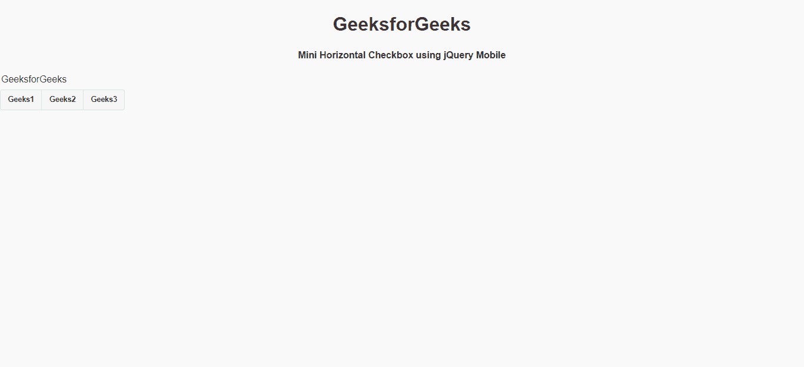
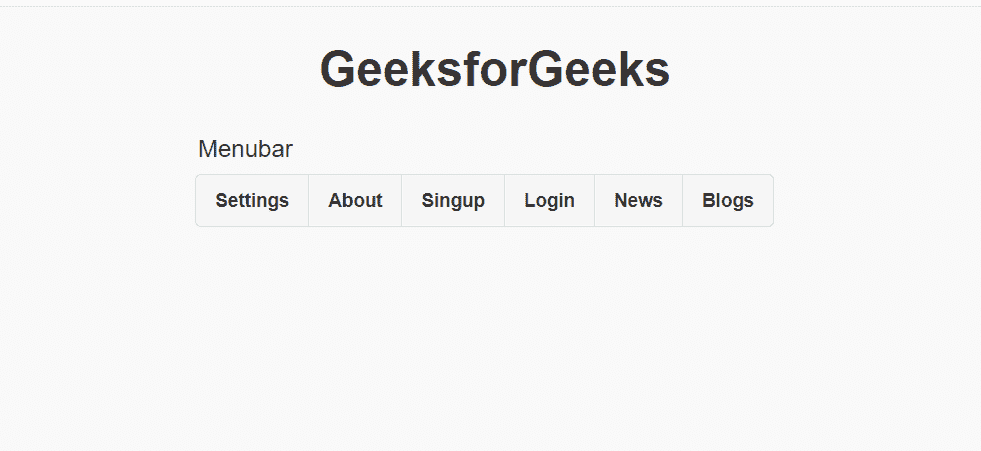

# 如何使用 jQuery Mobile 制作迷你水平复选框控件组？

> 原文:[https://www . geesforgeks . org/how-make-mini-horizontal-checkbox-control groups-use-jquery-mobile/](https://www.geeksforgeeks.org/how-to-make-mini-horizontal-checkbox-controlgroups-using-jquery-mobile/)

jQuery Mobile 是一种基于网络的技术，用于制作可在所有智能手机、平板电脑和台式机上访问的响应内容。迷你水平复选框控件组按钮可以很容易地使用 jQuery 手机。

**包含脚本:**您可以通过将这些标签添加到您的 *<头>* 标签中，将 jQuery 移动脚本添加到您的项目中。

> <link rel="”stylesheet”<br/">href = " http://code . jquery . com/mobile/1 . 4 . 5/jquery . mobile-1 . 4 . 5 . min . CSS "/>t1<src = " http://code . jquery . com/jquery-1 . 11 . 1 . min . js "></script>

**例 1:**

## 超文本标记语言

```html
<!DOCTYPE html>
<html>

<head>
    <link rel="stylesheet" href=
"http://code.jquery.com/mobile/1.4.5/jquery.mobile-1.4.5.min.css" />

    <script src=
        "http://code.jquery.com/jquery-1.11.1.min.js">
    </script>

    <script src=
"http://code.jquery.com/mobile/1.4.5/jquery.mobile-1.4.5.min.js">
    </script>
</head>

<body>
    <center>
        <h1>GeeksforGeeks</h1>

        <h4>
            Mini Horizontal Checkbox 
            using jQuery Mobile
        </h4>
    </center>

    <fieldset data-role="controlgroup" 
        data-type="horizontal" data-mini="true">
        <legend>GeeksforGeeks</legend>

        <input type="checkbox" name="gfg" id="gfg1">
        <label for="gfg1">Geeks1</label>

        <input type="checkbox" name="gfg" id="gfg2">
        <label for="gfg2">Geeks2</label>

        <input type="checkbox" name="gfg" id="gfg3">
        <label for="gfg3">Geeks3</label>
    </fieldset>
</body>

</html>
```

**输出:**



**例 2:**

## 超文本标记语言

```html
<!DOCTYPE html>
<html>

<head>
    <link rel="stylesheet" href=
"http://code.jquery.com/mobile/1.4.5/jquery.mobile-1.4.5.min.css" />

    <script src=
        "http://code.jquery.com/jquery-1.11.1.min.js">
    </script>

    <script src=
"http://code.jquery.com/mobile/1.4.5/jquery.mobile-1.4.5.min.js">
    </script>
</head>

<body>
    <center>
        <h1>GeeksforGeeks</h1>
    </center>

    <fieldset data-role="controlgroup" 
        data-type="horizontal" data-mini="true" 
        style="margin: auto; width: 400px;">
        <legend>Menubar</legend>

        <input type="checkbox" name="gfg" id="gfg1">
        <label for="gfg1">Settings</label>

        <input type="checkbox" name="gfg" id="gfg2">
        <label for="gfg2">About</label>

        <input type="checkbox" name="gfg" id="gfg3">
        <label for="gfg3">Singup</label>

        <input type="checkbox" name="gfg" id="gfg4">
        <label for="gfg4">Login</label>

        <input type="checkbox" name="gfg" id="gfg5">
        <label for="gfg5">News</label>

        <input type="checkbox" name="gfg" id="gfg6">
        <label for="gfg6">Blogs</label>
    </fieldset>
</body>

</html>
```

**输出:**

