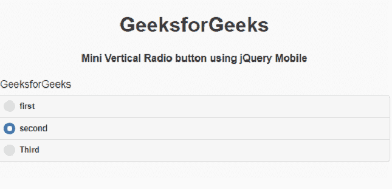
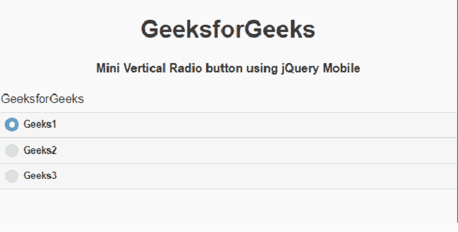

# 如何使用 jQuery Mobile 制作迷你垂直单选按钮控件组？

> 原文:[https://www . geesforgeks . org/how-make-mini-vertical-radio-button-control group-use-jquery-mobile/](https://www.geeksforgeeks.org/how-to-make-mini-vertical-radio-button-controlgroups-using-jquery-mobile/)

**jQuery Mobile** 是一种基于网络的技术，用于制作可在所有智能手机、平板电脑和台式机上访问的响应内容。在本文中，我们将使用 **jQuery Mobile** 制作一个迷你垂直单选按钮控件组按钮。

**进场:**

*   添加项目所需的 jQuery 移动脚本。

    > <link rel="”stylesheet”" href="”http://code.jquery.com/mobile/1.4.5/jquery.mobile-1.4.5.min.css”">
    > <脚本 src = " http://code。jquery。com/jquery-1。11 .1 .量滴 js " > < /脚本>
    > <脚本 src = " http://code。jquery。com/mobile/1。4 .5/jquery。移动一号。4 .5 .量滴 js " > < /脚本>

**例 1:**

## 超文本标记语言

```html
<!DOCTYPE html>
<html>

<head>
    <link rel="stylesheet" href=
"http://code.jquery.com/mobile/1.4.5/jquery.mobile-1.4.5.min.css" />

    <script src="http://code.jquery.com/jquery-1.11.1.min.js">
    </script>

    <script src=
"http://code.jquery.com/mobile/1.4.5/jquery.mobile-1.4.5.min.js">
    </script>
</head>

<body>
    <center>
        <h1>GeeksforGeeks</h1>

        <h4>
            Mini Vertical Radio button 
            using jQuery Mobile
        </h4>
    </center>

    <fieldset data-role="controlgroup" 
        data-mini="true">
        <legend>GeeksforGeeks</legend>

        <input type="radio" name="gfg" 
            id="gfg1" value="on">
        <label for="gfg1">first</label>

        <input type="radio" name="gfg" 
            id="gfg2" value="off" checked="checked">
        <label for="gfg2">second</label>

        <input type="radio" name="gfg" 
            id="gfg3" value="other">
        <label for="gfg3">Third</label>
    </fieldset>
</body>

</html> 
```

**输出:**



**例 2:**

## 超文本标记语言

```html
<!DOCTYPE html>
<html>

<head>
    <link rel="stylesheet" href=
"http://code.jquery.com/mobile/1.4.5/jquery.mobile-1.4.5.min.css" />

    <script src="http://code.jquery.com/jquery-1.11.1.min.js">
    </script>

    <script src=
"http://code.jquery.com/mobile/1.4.5/jquery.mobile-1.4.5.min.js">
    </script>
</head>

<body>
    <center>
        <h1>GeeksforGeeks</h1>

        <h4>
            Mini Vertical Radio button 
            using jQuery Mobile
        </h4>
    </center>

    <fieldset data-role="controlgroup" 
        data-mini="true">
        <legend>GeeksforGeeks</legend>

        <input type="radio" name="gfg" id="gfg1" 
            value="on" checked="checked">
        <label for="gfg1">Geeks1</label>

        <input type="radio" name="gfg" 
            id="gfg2" value="off">
        <label for="gfg2">Geeks2</label>

        <input type="radio" name="gfg" 
            id="gfg3" value="other">
        <label for="gfg3">Geeks3</label>
    </fieldset>
</body>

</html>
```

**输出:**

