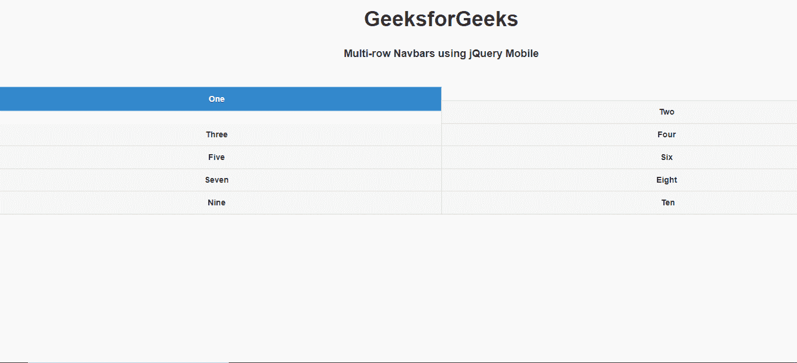

# 如何用 jQuery Mobile 制作多行 Navbar？

> 原文:[https://www . geeksforgeeks . org/如何制作-多行-nav bar-使用-jquery-mobile/](https://www.geeksforgeeks.org/how-to-make-multi-row-navbar-using-jquery-mobile/)

jQuery Mobile 是一种基于网络的技术，用于制作可在所有智能手机、平板电脑和台式机上访问的响应内容。在本文中，我们将使用 jQuery Mobile 制作多行导航栏。

**方法:**首先，添加项目所需的 jQuery Mobile 脚本。

> <link rel="”stylesheet”" href="”http://code.jquery.com/mobile/1.4.5/jquery.mobile-1.4.5.min.css”">
> <脚本 src = " http://code . jquery . com/jquery-1 . 11 . 1 . min . js "></脚本>
> <脚本 src = " http://code . jquery . com/mobile/1 . 4 . 5/jquery . mobile-1 . 4 . 5 . min . js "></脚本>

**示例:**

## 超文本标记语言

```html
<!DOCTYPE html>
<html>

<head>
    <link rel="stylesheet" href=
"http://code.jquery.com/mobile/1.4.5/jquery.mobile-1.4.5.min.css" />

    <script src=
        "http://code.jquery.com/jquery-1.11.1.min.js">
    </script>

    <script src=
"http://code.jquery.com/mobile/1.4.5/jquery.mobile-1.4.5.min.js">
    </script>
</head>

<body>
    <center>
        <h1>GeeksforGeeks</h1>
        <h4>Multi-row Navbars using jQuery Mobile</h4>
    </center>

    <div data-role="navbar">
        <ul>
            <li><a href="https://www.geeksforgeeks.org/"
                class="ui-btn-active">One</a></li>
            <li><a href="https://www.geeksforgeeks.org/">
                Two</a></li>
            <li><a href="https://www.geeksforgeeks.org/">
                Three</a></li>
            <li><a href="https://www.geeksforgeeks.org/">
                Four</a></li>
            <li><a href="https://www.geeksforgeeks.org/">
                Five</a></li>
            <li><a href="https://www.geeksforgeeks.org/">
                Six</a></li>
            <li><a href="https://www.geeksforgeeks.org/">
                Seven</a></li>
            <li><a href="https://www.geeksforgeeks.org/">
                Eight</a></li>
            <li><a href="https://www.geeksforgeeks.org/">
                Nine</a></li>
            <li><a href="https://www.geeksforgeeks.org/">
                Ten</a></li>
        </ul>
    </div>
</body>

</html> 
```

**输出:**

