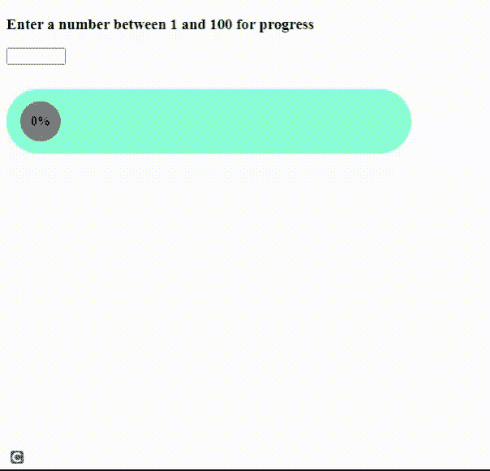

# 如何使用 jQuery 制作进度条图？

> 原文:[https://www . geeksforgeeks . org/如何取得进展-条形图-使用-jquery/](https://www.geeksforgeeks.org/how-to-make-progress-bar-chart-using-jquery/)

假设您正在准备某些数据的表格数据。因此，条形图用于以图形方式表示数据，以获得更好的视觉帮助。数据可以从一群人的年龄变化到某个范围，某个学科的学生分数。

**方法:**我们将创建初始值为 10%的 HTML 进度条。我们将设计各种颜色和图案的进度条。然后我们将为进度条创建 JavaScript 代码。

**实现代码:**

## 超文本标记语言

```html

<!DOCTYPE html>
<html lang="en">

<head>
    <meta charset="UTF-8">
    <meta name="viewport" content=
        "width=device-width, initial-scale=1.0">

    <style>
        .bar {
            width: 500px;
            height: 80px;
            background-color: aquamarine;
            border-radius: 100px;
            display: flex;
            align-items: center;
        }

        .progress {
            width: 467px;
            width: 50px;
            height: 50px;
            background-color: grey;
            border-radius: 100px;
            margin-left: 17px;
        }

        .percentage {
            position: absolute;
            margin-left: 30px;
            font-weight: bold;
        }

        input {
            margin-bottom: 30px;
        }
    </style>
</head>

<body>
    <h3>
        Enter a number between 1 
        and 100 for progress
    </h3>

    <input type="number" min="0" max="100">

    <div class="bar">
        <div class="progress">
        </div>
        <div class="percentage">0%</div>
    </div>

    <script>
        const input = document.querySelector('input');
        const progress = document.querySelector('.progress');
        const percentage = document.querySelector('.percentage');
        console.log(progress)
        let percentComplete = 0;

        input.onchange = function () {
            percentComplete = input.value
            console.log(percentComplete);

            progress.style.width = 
                `${percentComplete / 100 * 417 + 50}px`;

            percentage.innerHTML = `${percentComplete}%`;
        };
    </script>
</body>

</html>
```

**输出:**
