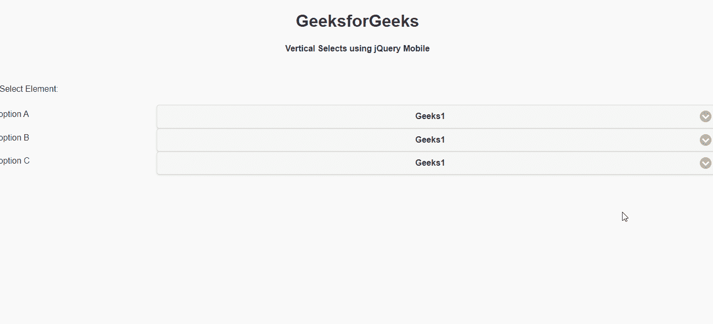

# 如何使用 jQuery Mobile 进行垂直选择？

> 原文:[https://www . geeksforgeeks . org/如何使用 jquery-mobile 进行垂直选择/](https://www.geeksforgeeks.org/how-to-make-vertical-selects-using-jquery-mobile/)

jQuery Mobile 是一种基于网络的技术，用于制作可在所有智能手机、平板电脑和台式机上访问的响应内容。在本文中，我们将使用 jQuery Mobile 进行垂直选择。

**方法:**首先，添加项目所需的 jQuery Mobile 脚本。

> <link rel="”stylesheet”" href="”http://code.jquery.com/mobile/1.4.5/jquery.mobile-1.4.5.min.css”/">
> <脚本 src = " http://code . jquery . com/jquery-1 . 11 . 1 . min . js "></脚本>
> <脚本 src = " http://code . jquery . com/mobile/1 . 4 . 5/jquery . mobile-1 . 4 . 5 . min . js "></脚本>

**示例:**

## 超文本标记语言

```html
<!DOCTYPE html>
<html>

<head>
    <link rel="stylesheet" href=
"http://code.jquery.com/mobile/1.4.5/jquery.mobile-1.4.5.min.css" />

    <script src=
        "http://code.jquery.com/jquery-1.11.1.min.js">
    </script>

    <script src=
"http://code.jquery.com/mobile/1.4.5/jquery.mobile-1.4.5.min.js">
    </script>
</head>

<body>

    <center>
        <h1>GeeksforGeeks</h1>
        <h4>Vertical Selects using jQuery Mobile</h4>
    </center>

    <form>
        <fieldset data-role="fieldcontain">
            <legend>Select Element:</legend>
            <label for="Geeks">option A</label>
            <select name="Geeks" id="Geeks">
                <option value="1">Geeks1</option>
                <option value="2">Geeks2</option>
                <option value="3">Geeks3</option>
                <option value="4">Geeks4</option>
            </select>
            <label for="Geeks">option B</label>
            <select name="Geeks" id="Geeks">
                <option value="1">Geeks1</option>
                <option value="2">Geeks2</option>
                <option value="3">Geeks3</option>
                <option value="4">Geeks4</option>
            </select>
            <label for="Geeks">option C</label>
            <select name="Geeks" id="Geeks">
                <option value="1">Geeks1</option>
                <option value="2">Geeks2</option>
                <option value="3">Geeks3</option>
                <option value="4">Geeks4</option>
            </select>
        </fieldset>
    </form>
</body>

</html>
```

**输出:**

