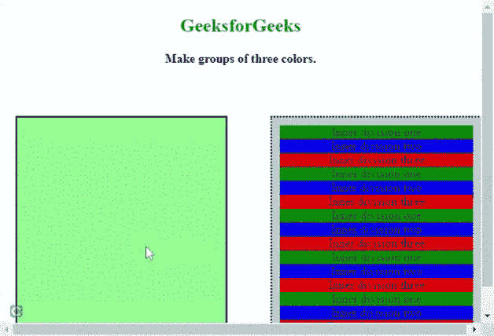

# 如何使用 jQuery 将一个 DIV 元素移到另一个里面？

> 原文:[https://www . geesforgeks . org/how-to-move-one-div-element-inside-other-use-jquery/](https://www.geeksforgeeks.org/how-to-move-one-div-element-inside-another-using-jquery/)

在本文中，我们将学习使用 jQuery 将一个 HTML *div* 元素移动到另一个元素中。

HTML [*div*](https://www.geeksforgeeks.org/div-tag-html/) 元素用于定义 HTML 文档中的一个分部或一个部分。

**使用的方法:**

*   [**parent()**](https://www.geeksforgeeks.org/jquery-parent-parents-with-examples/)**:**该方法用于获取当前匹配元素集合中每个元素的父元素，可选通过选择器进行过滤。
*   [**detach():**](https://www.geeksforgeeks.org/jquery-detach-with-examples/)**此方法用于从 DOM 树中移除所选元素，包括其所有文本和子节点，但保留数据和事件。**
*   **[**【attr()**](https://www.geeksforgeeks.org/jquery-attr-method/)**:此方法用于设置或返回所选元素的属性和值。****
*   **[**appendTo():**](https://www.geeksforgeeks.org/jquery-append-method/)**此方法用于在选中元素的末尾插入 HTML 元素。****

******进场:******

*   ****在分割元素中创建带有不同分割的 HTML 页面。****
*   ****接下来，使用上述方法创建一个函数来移动内部划分元素 [*onclick*](https://www.geeksforgeeks.org/html-dom-onclick-event/) 事件。****

******示例:******

## ****超文本标记语言****

```
**<!DOCTYPE html>
<html>
  <head>
    <script src=
"https://code.jquery.com/jquery-git.js">
    </script>
    <meta charset="utf-8" />
    <meta name="viewport" content="width=device-width" />

    <style>
      body {
        text-align: center;
      }
      #nonSelected {
        position: absolute;
        top: 150px;
        left: 350px;
        width: 250px;
        height: 280px;
        background-color: lightblue;
        border-width: 2px;
        border-style: dotted;
        border-color: black;
        padding: 10px;
      }

      #selected {
        position: absolute;
        top: 150px;
        left: 20px;
        width: 250px;
        height: 280px;
        background-color: lightgreen;
        font-style: italic;
        border-width: 2px;
        border-style: solid;
        border-color: black;
        padding: 10px;
      }
    </style>
  </head>
  <body>
    <h2 style="color: green">GeeksforGeeks</h2>
    <b>Make groups of three colors.</b>

    <div id="nonSelected">
      <div id="div1" onclick="move(this)" 
           style="background-color: green">
        Inner division one
      </div>
      <div id="div2" onclick="move(this)" 
           style="background-color: blue">
        Inner division two
      </div>
      <div id="div3" onclick="move(this)" 
           style="background-color: red">
        Inner division three
      </div>
      <div id="div1" onclick="move(this)" 
           style="background-color: green">
        Inner division one
      </div>
      <div id="div2" onclick="move(this)" 
           style="background-color: blue">
        Inner division two
      </div>
      <div id="div3" onclick="move(this)" 
           style="background-color: red">
        Inner division three
      </div>
      <div id="div1" onclick="move(this)" 
           style="background-color: green">
        Inner division one
      </div>
      <div id="div2" onclick="move(this)" 
           style="background-color: blue">
        Inner division two
      </div>
      <div id="div3" onclick="move(this)" 
           style="background-color: red">
        Inner division three
      </div>
      <div id="div1" onclick="move(this)" 
           style="background-color: green">
        Inner division one
      </div>
      <div id="div2" onclick="move(this)" 
           style="background-color: blue">
        Inner division two
      </div>
      <div id="div3" onclick="move(this)" 
           style="background-color: red">
        Inner division three
      </div>
      <div id="div1" onclick="move(this)" 
           style="background-color: green">
        Inner division one
      </div>
      <div id="div2" onclick="move(this)" 
           style="background-color: blue">
        Inner division two
      </div>
      <div id="div3" onclick="move(this)" 
           style="background-color: red">
        Inner division three
      </div>
    </div>
    <div id="selected"></div>
    <script>
      function move(elem) {
        if ($(elem).parent().attr("id") == "nonSelected") {
          $(elem).detach().appendTo("#selected");
        } else {
          $(elem).detach().appendTo("#nonSelected");
        }
      }
    </script>
  </body>
</html>**
```

******输出:****** 

****

从一个分区到另一个分区****