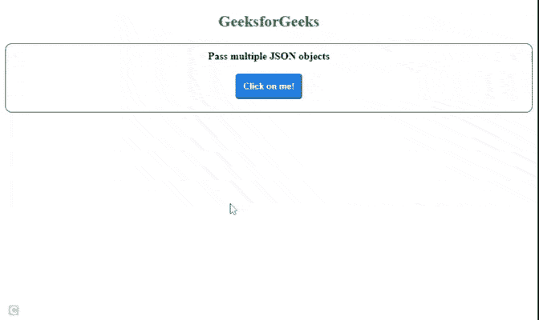

# 如何使用 jQuery 的$，将多个 JSON 对象作为数据传递。ajax()？

> 原文:[https://www . geeksforgeeks . org/how-pass-multi-JSON-objects-as-data-use-jquerys-Ajax/](https://www.geeksforgeeks.org/how-to-pass-multiple-json-objects-as-data-using-jquerys-ajax/)

本文的目的是在一个 HTML 文档中使用 jQuery [$ajax()](https://www.geeksforgeeks.org/jquery-ajax-method/) 方法将多个 JSON 对象作为数据传递。

**方法:**在 HTML 文档中创建一个按钮，将 JSON 对象发送到 PHP 服务器。在 JavaScript 文件中，给按钮添加一个[点击](https://www.geeksforgeeks.org/jquery-click-with-examples/)事件监听器。点击按钮，使用 jQuery *$ajax()* 方法请求 PHP 文件，通过该方法多个 JSON 对象被传递到服务器。

**HTML 代码:**以下代码演示了用户界面的设计或结构。在点击 HTML 按钮时，它会在*结果标识* HTML 分区中给出 PHP 服务器的响应。

## index.html

```
<!DOCTYPE html>
<html lang="en">

<head>
    <meta charset="UTF-8">

    <meta name="viewport" 
          content="width=device-width, initial-scale=1.0">

    <!-- CSS file -->
    <link rel="stylesheet" href="style.css">

    <!-- jQuery Ajax CDN -->
    <script src=
"https://cdnjs.cloudflare.com/ajax/libs/jquery/3.6.0/jquery.min.js">
    </script>

    <!-- JavaScript file -->
    <script src="script.js"></script>
</head>

<body>
     <center>
     <h2 style="color:green">GeeksforGeeks</h2>
     <div class="container">
        <b>Pass multiple JSON objects</b>
        <br/><br/>
        <!-- Button to multiple JSON objects -->
        <button type="button" id="btn">
            Click on me!
        </button>
        <div style="height:10px"></div>
        <div id="resultID"></div>
     </div>
     </center>
</body>

</html>
```

**CSS 代码:**以下代码是上述 HTML 代码中使用的文件“style.css”的内容。

## 样式，css

```
.container {
  border: 1px solid rgb(73, 72, 72);
  border-radius: 10px;
  margin: auto;
  padding: 10px;
  text-align: center;
}

button {
  border-radius: 5px;
  padding: 10px;
  color: #fff;
  background-color: #167deb;
  border-color: #0062cc;
  font-weight: bolder;
  cursor: pointer;
}

button:hover {
  text-decoration: none;
  background-color: #0069d9;
  border-color: #0062cc;
}
```

**JavaScript 代码:**以下代码是上述 HTML 代码中使用的文件“script.js”的内容。它使用 jQuery ajax()方法处理按钮的 *click()* 事件，并将数据传递到一个 PHP 服务器文件，即*action.php*

## script.js

```
$(document).ready(() => {

  // Adding 'click' event listener to button
  $("#btn").click(() => {

    // Two JSON objects are passed to server    
    let obj1 = {"name": "John Doe"};
    let obj2 = {"name": "Duke"};

    // jQuery Ajax Post Request using $.ajax()
    $.ajax({
        url: 'action.php',
        type: 'POST',
        // passing JSON objects as comma(,) separated values
        data: {
            obj1,
            obj2
        },
        success: (response) => {
            // response from PHP back-end PHP server          
           $("#resultID").show().html(response);
        }
    })
  });
});
```

**注意:**可以通过使用逗号(，)来传递尽可能多的 JSON 对象，分隔值即 obj1、obj2、obj3、..

**PHP 代码:**以下是上述 JavaScript 代码中使用的文件“action.php”的代码。

## 服务器端编程语言（Professional Hypertext Preprocessor 的缩写）

```
<?php

// Check if JSON Objects are set by user 

if (isset($_POST['obj1']) && $_POST['obj2'])
{
  // Get JSON objects in variables
   $obj1 = $_POST['obj1'];
   $obj2 = $_POST['obj2'];

  // Sending response to script file 
  echo "Success";
}
?>
```

**输出:**



多个数据传递和获取响应