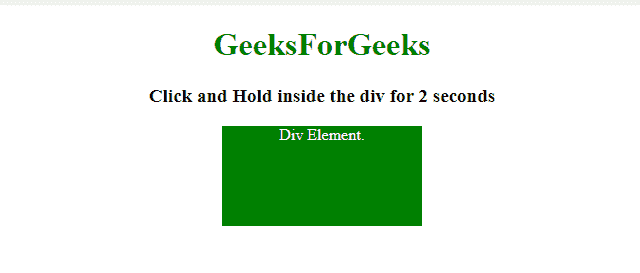
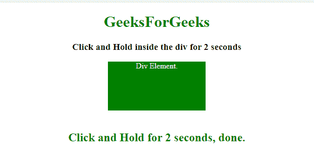
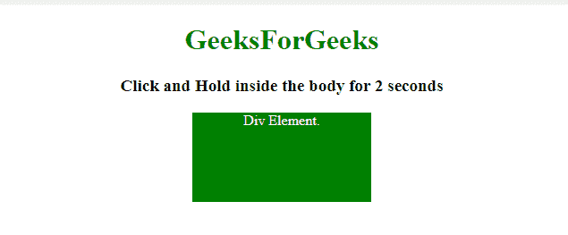
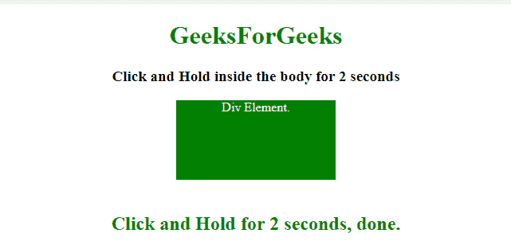

# 如何使用 jQuery 在元素内部执行点击保持操作？

> 原文:[https://www . geeksforgeeks . org/如何使用-jquery/](https://www.geeksforgeeks.org/how-to-perform-click-and-hold-operation-inside-an-element-using-jquery/) 在元素内部执行点击并按住操作

给定一个 HTML 元素，任务是单击并按住文档中的一个元素几秒钟，使用 jQuery 执行操作。

**进场:**

*   选择一个 HTML 元素。
*   向该元素添加事件侦听器，并为该事件添加超时计时器。
*   如果该事件碰巧激活了几秒钟，则触发其他事件来识别该事件的发生。

**示例 1:** 在本例中，在 div 内点击并保持 2 秒将触发其他事件，该事件只是打印发生的事件。

```html
<!DOCTYPE HTML> 
<html> 

<head> 
    <title> 
        How to perform click-and-hold operation
        inside an element using jQuery ?
    </title>

    <style>
        #div {
            background: green;
            height: 100px;
            width: 200px;
            margin: 0 auto;
            color: white;
        }
    </style>

    <script src = 
"https://ajax.googleapis.com/ajax/libs/jquery/3.4.0/jquery.min.js">
    </script>
</head> 

<body style = "text-align:center;"> 

    <h1 style = "color:green;"> 
        GeeksForGeeks 
    </h1>

    <p id = "GFG_UP" style = 
        "font-size: 19px; font-weight: bold;">
    </p>

    <div id = "div">
        Div Element.
    </div>
    <br>

    <p id = "GFG_DOWN" style = 
        "color: green; font-size: 24px; font-weight: bold;">
    </p>

    <script>
        $('#GFG_UP').text("Click and Hold inside the"
                    + " div for 2 seconds");

        var tId = 0;

        $('#div').on('mousedown', function() {
            tId = setTimeout(GFG_Fun, 2000);
        }).on('mouseup mouseleave', function() {
            clearTimeout(tId);
        });

        function GFG_Fun() {
            $('#GFG_DOWN').text("Click and Hold for 2 "
                    + "seconds, done.");
        }
    </script> 
</body>

</html>
```

**输出:**

*   **点击按钮前:**
    
*   **点击按钮后:**
    

**示例 2:** 在本例中，在正文文档内点击并保持 2 秒钟将触发其他事件，该事件只是打印发生的事件。这个例子分离了**鼠标下移**和**鼠标上移**事件的逻辑。

```html
<!DOCTYPE HTML> 
<html> 

<head> 
    <title> 
        How to perform click-and-hold operation
        inside an element using jQuery ?
    </title>

    <style>
        #div {
            background: green;
            height: 100px;
            width: 200px;
            margin: 0 auto;
            color: white;
        }
    </style>

    <script src = 
"https://ajax.googleapis.com/ajax/libs/jquery/3.4.0/jquery.min.js">
    </script>
</head> 

<body style = "text-align:center;"> 

    <h1 style = "color:green;"> 
        GeeksForGeeks 
    </h1>

    <p id = "GFG_UP" style =
        "font-size: 19px; font-weight: bold;">
    </p>

    <div id = "div">
        Div Element.
    </div>
    <br>

    <p id = "GFG_DOWN" style = 
        "color: green; font-size: 24px; font-weight: bold;">
    </p>

    <script>
        $('#GFG_UP').text("Click and Hold inside the"
                    + " div for 2 seconds");

        var tId = 0;

        $("#div").mousedown(function() {
            tId = setTimeout(GFG_Fun, 2000);
            return false;
        });
        $("#div").mouseup(function() {
            clearTimeout(tId);
        });

        function GFG_Fun() {
            $('#GFG_DOWN').text("Click and Hold for 2 "
                    + "seconds, done.");
        }
    </script> 
</body> 

</html>
```

**输出:**

*   **点击按钮前:**
    
*   **点击按钮后:**
    