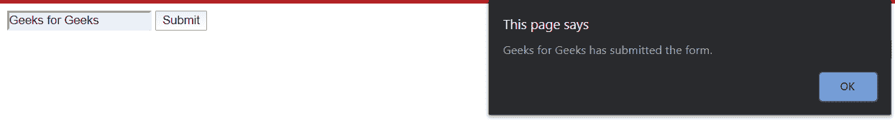

# 提交表单后如何进行 jQuery 回调？

> 原文:[https://www . geeksforgeeks . org/如何执行-jquery-提交表单后回调/](https://www.geeksforgeeks.org/how-to-perform-jquery-callback-after-submitting-the-form/)

表单提交后的*是触发提交按钮后执行的一组代码。通常，一旦提交，它就用来清空表单。例如，当登录凭证错误时，表单中的输入变为空白。*

***进场:***

1.  *首先，如果加载了表单，必须确保表单中的元素。*
2.  *然后，提交方法被添加了一个回调函数。*
3.  *单击提交按钮后，它应该会阻止连续的回调。*
4.  *随后，由于需要延迟，给出了一个超时。如果没有延迟，之后应该发生的行为将在开始时发生。就像在验证密码之前，输入表单不应该空白。*
5.  *最后给出了需要执行的操作。*

***如何用 Javascript 实现？***

1.  *使用提交按钮可以回调 jQuery 方法。*
2.  *一旦点击表单的提交按钮，回调函数就会被触发。但是，在此之前，必须加载 DOM(文档对象操作)。一旦加载了 DOM，它就会调用这些方法中的任何一个。(可以使用 window.on('load ')或 document.ready()或 window.ready()。*
3.  *preventDefault()方法防止该方法多次激发。*
4.  *我们使用 setTimeout 方法在提交几毫秒后执行。*

***注意:**加载所有资源时调用 window.ready()方法，加载 DOM 时调用 document.ready()方法。*

***示例:***

```html
*<!DOCTYPE html>
<html>

<head>
    <title>
        How to perform jQuery Callback
        after submitting the form ?
    </title>

    <script src=
"https://ajax.googleapis.com/ajax/libs/jquery/3.4.1/jquery.min.js">
    </script>

    <script>
        $(window).ready(function () {

            $("form").submit(function (e) {
                e.preventDefault();
                var name = $("#name").val();
                setTimeout(function () {
                    console.log("After timeout");
                    $('#name').val('');
                }, 100);
                alert(name + " has submitted");
            })

        })
    </script>
</head>

<body>
    <form action="">
        <input type="text" id="name">
        <input type="submit">
    </form>
</body>

</html>*
```

***输出:**
*

*这个表单提交方法触发回调方法，这首先会阻止进一步的回调。然后在 100 毫秒的时间间隔后，使用文本输入值调用 alert 方法。*