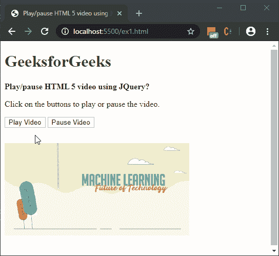
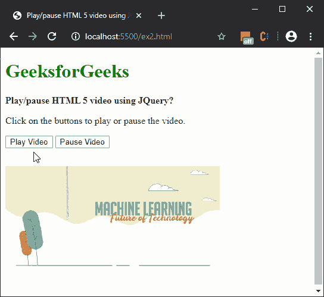

# 如何使用 jQuery 播放/暂停视频？

> 原文:[https://www . geesforgeks . org/how-play-pause-video-use-jquery/](https://www.geeksforgeeks.org/how-to-play-pause-video-using-jquery/)

**方法 1: [使用 trigger()方法:](https://www.geeksforgeeks.org/jquery-trigger-method/)** 使用 **trigger()** 方法执行指定的事件和事件的默认行为。要执行的事件作为参数传递给此方法。
播放事件用于播放任何媒体元素，同样暂停事件用于暂停任何媒体元素。将这些事件与 trigger()方法一起使用将根据需要播放或暂停视频。

**语法:**

```
// Play the video
$('#sample_video').trigger('play');

// Pause the video
$('#sample_video').trigger('pause');
```

**示例:**

```
<!DOCTYPE html>
<html>

<head>
    <title>
        How to play/pause video
        using JQuery?
    </title>

    <script src=
        "https://code.jquery.com/jquery-3.4.1.min.js">
    </script>
</head>

<body>
    <h1 style="color: green">
        GeeksforGeeks
    </h1>

    <b>
        Play/pause HTML 5 video
        using JQuery?
    </b>

    <p>
        Click on the buttons to play
        or pause the video.
    </p>

    <button onclick="playVideo()">
        Play Video
    </button>

    <button onclick="pauseVideo()">
        Pause Video
    </button>
    <br>

    <video id="sample_video" width="360" height="240">

        <source src=
"https://media.geeksforgeeks.org/wp-content/uploads/20200107020629/sample_video.mp4"
                type="video/mp4">
    </video>

    <script>
        function playVideo() {
            $('#sample_video').trigger('play');
        }
        function pauseVideo() {
            $('#sample_video').trigger('pause');
        }
    </script>
</body>

</html>
```

**输出:**


**方法 2:使用 play()和 pause()方法:**JavaScript 中的 **play()** 方法用于尝试播放媒体文件。在 jQuery 中，首先使用选择器选择视频文件，然后使用 get()方法选择实际元素。然后在这个元素上使用 play()方法来尝试启动视频。

JavaScript 中的 **pause()** 方法用于暂停媒体文件的播放。在 jQuery 中，首先使用选择器选择视频文件，然后使用 get()方法选择实际元素。然后在此元素上使用 pause()方法暂停视频。

**语法:**

```
// Play the video
$('#sample_video').get(0).play();

// Pause the video
$('#sample_video').get(0).pause();
```

**示例:**

```
<!DOCTYPE html>
<html>

<head>
    <title>
        How to play/pause video
        using JQuery?
    </title>

    <script src=
        "https://code.jquery.com/jquery-3.4.1.min.js">
    </script>
</head>

<body>
    <h1 style="color: green">
        GeeksforGeeks
    </h1>

    <b>
        Play/pause HTML 5 video
        using JQuery?
    </b>

    <p>
        Click on the buttons to play
        or pause the video.
    </p>

    <button onclick="playVideo()">
        Play Video
    </button>

    <button onclick="pauseVideo()">
        Pause Video
    </button>
    <br>

    <video id="sample_video" width="360" height="240">
        <source src=
"https://media.geeksforgeeks.org/wp-content/uploads/20200107020629/sample_video.mp4"
                type="video/mp4">
    </video>

    <script>
        function playVideo() {
            $('#sample_video').get(0).play();
        }

        function pauseVideo() {
            $('#sample_video').get(0).pause();
        }
    </script>
</body>

</html>
```

**输出:**


jQuery 是一个开源的 JavaScript 库，它简化了 HTML/CSS 文档之间的交互，它以其“少写多做”的理念而闻名。
跟随本 [jQuery 教程](https://www.geeksforgeeks.org/jquery-tutorials/)和 [jQuery 示例](https://www.geeksforgeeks.org/jquery-examples/)可以从头开始学习 jQuery。