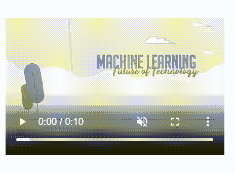

# 如何使用 jQuery 在 div 上悬停播放视频？

> 原文:[https://www . geeksforgeeks . org/how-play-video-on-hover-on-a-div-using-jquery/](https://www.geeksforgeeks.org/how-to-play-video-on-hover-on-a-div-using-jquery/)

给定网站上的一个视频，任务是在将光标悬停在视频上的同时播放它，并在使用 jQuery 事件从视频 div 中移除光标时停止视频播放。

**示例:**假设你赶时间，没有时间查看文章的整个视频，那么你只需将鼠标悬停在视频上即可查看其内容，无需打开整个视频。这种方法非常有效，可以节省用户的数据和时间。这种方法最常用于 YouTube 和其他流行的视频流网站，允许视频在光标悬停时播放。

**方法:**可以使用 jQuery 在悬停时播放视频。为此，他们需要有 mouseenter 功能，将鼠标光标悬停在视频上即可播放视频。同样，可以通过播放 jQuery 的 mouseleave 函数来暂停视频。

[**使用 jQuery mouseenter()方法**](https://www.geeksforgeeks.org/jquery-mouseenter-with-examples/)**:**mouse enter()方法是 jQuery 中的一个内置方法，当鼠标指针移动到所选元素上时，该方法就会工作。

[**使用 jQuery mouseleave()方法**](https://www.geeksforgeeks.org/jquery-mouseleave-with-examples/)**:**mouse leaf()方法是 jQuery 中的一个内置方法，当鼠标指针离开所选元素时，该方法会工作。

**代码实现:**

## 超文本标记语言

```html
<!DOCTYPE html>
<html>

<head>
    <meta charset="utf-8">
    <meta name="viewport" content=
        "width=device-width", initial-scale=1>
    <script src="https://code.jquery.com/jquery-3.3.1.slim.min.js"
        integrity=
"sha384-q8i/X+965DzO0rT7abK41JStQIAqVgRVzpbzo5smXKp4YfRvH+8abtTE1Pi6jizo"
        crossorigin="anonymous">
    </script>

    <script src="jquery.hoverplay.js"></script>
</head>

<body>
    <div id="video-wrapper">
        <video id="video" width="320" height="240" 
            controls data-play="hover" muted="muted">
            <source src=
"https://media.geeksforgeeks.org/wp-content/uploads/20200107020629/sample_video.mp4"
                type="video/mp4">
            Your browser does not 
            support the video tag.
        </video>
    </div>

    <script>

        // Getting video element using jQuery
        var video = $("#video");

        // Check if video is ready to play
        $(video).on('canplay', function () {
            $(video).mouseenter(function () {
                $(this).get(0).play();
            }).mouseleave(function () {
                $(this).get(0).pause();
            })
        });
    </script>
</body>

</html>
```

**输出:**

