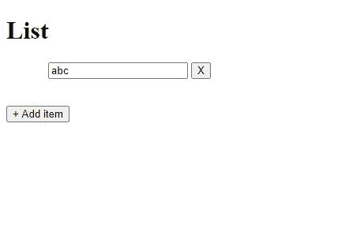
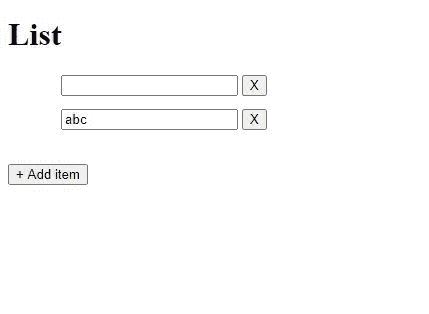

# 如何使用带有关闭事件的 jQuery 预先准备列表项？

> 原文:[https://www . geesforgeks . org/how-prepend-list-item-use-jquery-with-close-event/](https://www.geeksforgeeks.org/how-to-prepend-list-item-using-jquery-with-close-event/)

**简介:**任务是使用 jQuery 预先准备列表项。可以使用 jQuery 在列表中动态添加和删除项目。这可以通过使用事件处理程序来监听按钮点击来实现。我们将借助一个例子来理解这一点。

**示例:**

```html
<!DOCTYPE html>
<html>

<head>
    <style>
        li {
            list-style: none;
            margin: 1%;
        }
    </style>

    <script src=
"https://cdnjs.cloudflare.com/ajax/libs/jquery/3.3.1/jquery.min.js">
    </script>
</head>

<body>

    <h1>List</h1>
    <ul id="list">

        <!-- List item with close button -->
        <li> <input type="text">
            <button class="close"> X</button>
        </li>
    </ul><br>

    <!-- Button to prepend list item -->
    <button class="add">+ Add item</button>

    <script>

        // When add button is clicked, 
        // list item is prepended
        $(".add").click(function () {
            $("#list").prepend(
'<li><input type = "text"><button class="close">X</button></li>');
        });

        // When close button is clicked, 
        // list item is removed
        $(document).on("click", 
            "button.close", function () {
                $(this).parent().remove();
            });
    </script>
</body>

</html>
```

**说明:**这里有一个列表(id =“list”)，有一个文本框和一个关闭按钮(class =“close”)。该按钮用于从列表中删除项目。在列表的末尾，我们有一个添加按钮(class =“add”)，用于在开头添加一个新的列表项。

```html
$(".add").click(function () {
    $("#list").prepend('<li>
    <input type="text"> 
    <button class="close"> 
        X
    </button></li>');
});

```

。click()被添加到“add”按钮中，用于收听鼠标点击。当单击按钮时，使用 prepend()函数添加一个带有文本框和关闭按钮(具有相同的“关闭”类)的列表项。我们使用了 prepend 函数，因为我们想在列表的开头添加一个项目。为了在末尾添加一个项目，将使用 append()。

```html
$(document).on("click", "button.close", function () {
    $(this).parent().remove();
});

```

这里我们使用 on()函数来监听鼠标点击，因为 click()不适用于动态生成的元素。现在它也将为新添加的“关闭”按钮工作。当点击子类“关闭”按钮时，其父项(

*   , list item) is removed.

**Output:**

*   **原列表**
    *   **点击添加按钮后**

    

    **点击添加项目后，一个新的列表项目被添加到列表的开头**