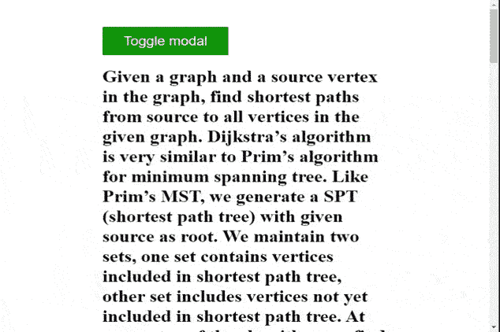

# 使用 jQuery 打开模态时，如何防止 Body 滚动？

> 原文:[https://www . geesforgeks . org/如何使用-jquery/](https://www.geeksforgeeks.org/how-to-prevent-body-from-scrolling-when-a-modal-is-opened-using-jquery/) 防止打开模态时身体滚动

给定一个带有模式的 HTML 文档，任务是在模式处于打开状态时防止主体元素滚动。使用 JavaScript 可以轻松完成这项任务。

**方法:**这个问题的一个简单解决方案是，每当打开模态时，将主体元素的“*溢出*”属性的值设置为“*隐藏*”，这将禁用所选元素上的滚动。一旦模态关闭，我们将主体元素的“*溢出*”属性设置为“*自动*”，以便在主体元素上启用滚动功能。为了确定模态是否被打开，我们将使用 JavaScript 的 **classList.contains()** 方法检查它的类列表中是否有隐藏的*CSS 类。这个“*”隐藏的*”类负责按钮点击时模态的打开和关闭(改变显示属性)。为了更好地理解，请查看给定的示例。*

***示例:***

## *超文本标记语言*

```html
*<!DOCTYPE html>
<html lang="en">

<head>
    <meta charset="UTF-8" />
    <meta name="viewport" content=
        "width=device-width, initial-scale=1.0" />

    <style>
        body {
            padding: 5% 20%;
        }

        #container {
            z-index: 1;
        }

        #btn {
            border: none;
            font-size: 24px;
            padding: 12px 36px;
            color: white;
            background-color: green;
        }

        #modal {
            height: 200px;
            width: 400px;
            padding: 60px;
            position: absolute;
            top: 50%;
            left: 50%;
            transform: translate(-50%, -50%);
            z-index: 999;
            background-color: green;
            color: white;
        }

        .hidden {
            display: none;
        }
    </style>
</head>

<body>

    <!--Button to toggle modal-->
    <button id="btn" onclick="showModal()">
        Toggle modal
    </button>

    <!--Modal container-->
    <div id="modal" class="hidden">
        <div id="modal-body">
            <h1>GeeksforGeeks</h1>
            <h2>This is a modal</h2>
        </div>
    </div>

    <!--Long text so that the body scrolls-->
    <div id="container">
        <h1>
            Given a graph and a source vertex in 
            the graph, find shortest paths from 
            source to all vertices in the given 
            graph. Dijkstra’s algorithm is very 
            similar to Prim’s algorithm for minimum
            spanning tree. Like Prim’s MST, we 
            generate a SPT (shortest path tree) 
            with given source as root.
            We maintain two sets, one set contains 
            vertices included in shortest path tree,
            other set includes vertices not yet 
            included in shortest path tree. At every
            step of the algorithm, we find a vertex 
            which is in the other set (set of not yet
            included) and has a minimum distance from
            the source. Below are the detailed steps
            used in Dijkstra’s algorithm to find the
            shortest path from a single source vertex
            to all other vertices in the given graph.
            Algorithm Create a set sptSet (shortest 
            path tree set) that keeps track of vertices
            included in shortest path tree, i.e., whose
            minimum distance from source is calculated 
            and finalized. Initially, this set is empty.
            Assign a distance value to all vertices in 
            the input graph. Initialize all distance 
            values as INFINITE.
            Assign distance value as 0 for the source 
            vertex so that it is picked first. While 
            sptSet doesn’t include all vertices Pick a 
            vertex u which is not there in sptSet and 
            has minimum distance value. Include u to 
            sptSet. Update distance value of all adjacent 
            vertices of u. To update the distance values,
            iterate through all adjacent vertices. For 
            every adjacent vertex v, if sum of distance 
            value of u (from source) and weight of edge 
            u-v, is less than the distance value of v,
            then update the distance value of v.

            Given a graph and a source vertex in the 
            graph, find shortest paths from source to
            all vertices in the given graph. Dijkstra’s 
            algorithm is very similar to Prim’s 
            algorithm for minimum spanning tree.
            Like Prim’s MST, we generate a SPT (shortest 
            path tree) with given source as root.
            We maintain two sets, one set contains 
            vertices included in shortest path tree, 
            other set includes vertices not yet included
            in shortest path tree.
            At every step of the algorithm, we find a 
            vertex which is in the other set (set of not 
            yet included) and has a minimum distance 
            from the source.

            Below are the detailed steps used in 
            Dijkstra’s algorithm to find the shortest 
            path from a single source vertex to all other 
            vertices in the given graph. Algorithm
            Create a set sptSet (shortest path tree set) 
            that keeps track of vertices included in 
            shortest path tree, i.e., whose minimum 
            distance from source is calculated and 
            finalized. Initially, this set is empty. Assign 
            a distance value to all vertices in the input 
            graph. Initialize all distance values as INFINITE.
            Assign distance value as 0 for the source 
            vertex so that it is picked first. While sptSet 
            doesn’t include all vertices Pick a vertex u 
            which is not there in sptSet and has minimum 
            distance value. Include u to sptSet.
            Update distance value of all adjacent vertices 
            of u. To update the distance values, iterate 
            through all adjacent vertices. For every 
            adjacent vertex v, if sum of distance value 
            of u (from source) and weight of edge u-v, 
            is less than the distance value of v, then 
            update the distance value of v.
        </h1>
    </div>

    <script>

        // Select required elements from the DOM
        const modal = document.querySelector("#modal");
        const body = document.querySelector("body");

        const showModal = function (e) {
            modal.classList.toggle("hidden");

            if (!modal.classList.contains("hidden")) {
                // Disable scroll
                body.style.overflow = "hidden";
            } else {
                // Enable scroll
                body.style.overflow = "auto";
            }
        };
    </script>
</body>

</html>*
```

***输出:***

**