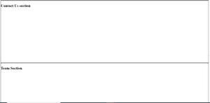

# 如何使用 HTML 或 jQuery 重定向到页面的特定部分？

> 原文:[https://www . geeksforgeeks . org/如何使用-html 或-jquery/](https://www.geeksforgeeks.org/how-to-redirect-to-a-particular-section-of-a-page-using-html-or-jquery/) 重定向到页面的特定部分

**方法 1:** **使用 HTML:**

可以使用锚点标签重定向到同一页面上的特定部分。您需要将“id attribute”添加到要显示的部分，并在 href 属性中使用相同的 id，在定位标记中使用“#”。这样，当你点击一个特定的链接时，你将被重定向到锚标签中提到的具有相同 id 的部分。

**语法:**

```
//anchor tag
<a href="#home_section">home</a>

<section id="home_section">Information About Page</section>
```

**示例**:当用户点击“联系我们”链接时，会被重定向到同一页面的“联系我们”部分。

```
<!DOCTYPE html>
<html>
   <head>
     <style>
     div{
       width :100%;
       height:400px;
       border : 1px solid black;
      }
    </style>
   </head>

   <body>
      <h2>Welcome to GeeksforGeeks</h2>
      <p>This is the example of <i>Redirect
 to a particular section using HTML on same page</i>
 </p>
      <a href="#contactUs"> Contact Us </a>
      <br/></br>
      <div>
        <h2>Home section</h2></h>
      </div>
      <div>
        <h2>About Us section</h2>
      </div>

      <div id = "contactUs">
        <h2>Contact Us section </h2>
      </div>
      <div>
        <h2>Team Section</h2>
      </div>
   </body>
</html>
```

**输出:**T2【全窗大小视图:
T4】

当用户点击“联系我们”链接时，用户将被重定向到“联系我们”部分。
全窗大小视图:


****方法二:**** 使用 JQuery:

scrollTop()方法设置或返回选定元素的垂直滚动条位置。

**注意:**滚动条在顶部时，位置为 0。

**语法:**

```
$(selector).scrollTop(position)
```

**使用 JQuery 重定向到特定部分:**

**语法:**

```
<a href="#" id="home">home</a>

$('#home').click(function(){
$(document).scrollTop(100) // any value you need
});
```

**示例:**当用户点击页面底部的“联系我们”链接时，他将被重定向到同一页面的“主页”部分。

```
<!DOCTYPE html>
<html>
   <head>
     <script>
           $("#contactUs").click(function(){
           // any value you need
           $(document).scrollTop(600) 
           });
     </script>

     <style>
     div{
       width :100%;
       height:400px;
       border : 1px solid black;
      }
    </style>
   </head>

   <body>
      <h2>Welcome to GeeksforGeeks</h2>
      <p>This is the example of <i>Redirect 
to a particular section using Jouery
 on same page</i> </p>
      <div>
        <h2>Home section</h2></h>
      </div>
      <div>
        <h2>About Us section</h2>
      </div>

      <div>
        <h2>Contact Us section </h2>
      </div>
      <div>
        <h2>Team Section</h2>
      </div>
      <br>
        <a href="#" id="contactUs"> Contact Us </a>

   </body>
</html>
```

**输出:**联系我们链接在页面底部:
全窗口大小视图:
T4】

当用户点击“联系我们”链接时，用户将被重定向到 600 像素的“主页”部分。
全窗大小视图:


jQuery 是一个开源的 JavaScript 库，它简化了 HTML/CSS 文档之间的交互，它以其“少写多做”的理念而闻名。
跟随本 [jQuery 教程](https://www.geeksforgeeks.org/jquery-tutorials/)和 [jQuery 示例](https://www.geeksforgeeks.org/jquery-examples/)可以从头开始学习 jQuery。