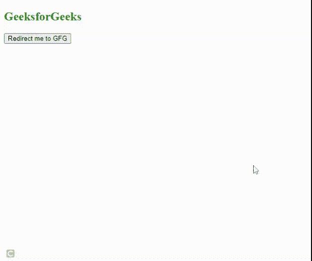

# 如何使用 jQuery 在 5 秒后重定向到另一页？

> 原文:[https://www . geeksforgeeks . org/如何使用-jquery/](https://www.geeksforgeeks.org/how-to-redirect-to-another-page-after-5-seconds-using-jquery/) 在 5 秒后重定向到另一页

在本文中，我们将学习如何在 jQuery 中指定的时间后重定向到另一个页面或网址。用于执行操作的内置函数如下。 [**setTimeout(回调、延迟)**](https://www.geeksforgeeks.org/java-script-settimeout-setinterval-method/) 函数取两个参数一个回调，一个时间以毫秒为单位。调用此方法时，回调函数将在指定时间后执行。使用此方法，回调函数仅在指定时间后执行一次。

我们的目标是在 5 秒钟后重定向到另一个页面，这只会发生一次。我们使用 jQuery **setTimeout()** 函数

**示例:**

## 超文本标记语言

```
<!DOCTYPE html>
<html lang="en">

<head>
    <!-- using jquery library -->
    <script 
        src="https://code.jquery.com/jquery-git.js">
    </script>    
</head>

<body>
    <h1 style="color: green;">
      Geeksforgeeks
    </h1>

    <!-- Creating a button -->
    <div class="redirect">
        <button>Redirect me to GFG</button>
    </div>

    <!-- Script which will redirect 
         us to another page    -->
    <script>
        // click event on button
        $("button").click(function(){
            $(".redirect").text("Redirecting....")

            // storing url and time
            let delay = 5000;
            let url = "https://www.geeksforgeeks.org/";
            setTimeout(function(){
                location = url;
            },5000)
        })
    </script>
</body>

</html>
```

**输出:**5 秒后“极客 forgeeks”主页打开。

