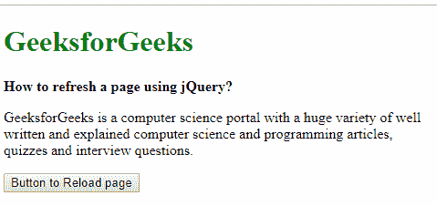
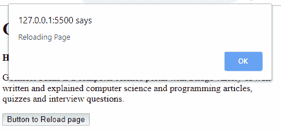

# 如何使用 jQuery 刷新页面？

> 原文:[https://www . geeksforgeeks . org/如何使用-jquery 刷新页面/](https://www.geeksforgeeks.org/how-to-refresh-a-page-using-jquery/)

**方法 1:使用[location . reload()](https://www.geeksforgeeks.org/html-dom-location-reload-method/):**location . reload()方法模拟点击浏览器上的刷新按钮来重新加载当前网页。传递给方法的可选 true 参数用于强制从服务器加载页面并忽略浏览器缓存。

**语法:**

```
location.reload(true)
```

**示例:**

```
<!DOCTYPE html>
<html>

<head>
    <title>
        How to refresh a page
        using jQuery?
    </title>

    <script src=
        "https://code.jquery.com/jquery-3.3.1.min.js">
    </script>
</head>

<body>
    <h1 style="color: green">
        GeeksforGeeks
    </h1>

    <b>
        How to refresh a page
        using jQuery?
    </b>

    <p>
        GeeksforGeeks is a computer science
        portal with a huge variety of well
        written and explained computer science
        and programming articles, quizzes
        and interview questions.
    </p>

    <button type="button">
        Button to Reload page
    </button>

    <script type="text/javascript">
        $(document).ready(function () {
            $("button").click(function () {
                location.reload(true);
                alert('Reloading Page');
            });
        });
    </script>
</body>

</html>                    
```

**方法 2:使用 history . go(0):**history . go()方法根据传递给它的参数从浏览器历史中加载一个 URL。如果传递的参数为“0”，它将重新加载当前页面。

**语法:**

```
history.go(0);
```

**示例:**

```
<!DOCTYPE html>
<html>

<head>
    <title>
        How to refresh a page
        using jQuery?
    </title>

    <script src=
        "https://code.jquery.com/jquery-3.3.1.min.js">
    </script>
</head>

<body>
    <h1 style="color: green">
        GeeksforGeeks
    </h1>

    <b>
        How to refresh a page
        using jQuery?
    </b>

    <p>
        GeeksforGeeks is a computer science
        portal with a huge variety of well
        written and explained computer science
        and programming articles, quizzes
        and interview questions.
    </p>

    <button type="button">
        Button to Reload page
    </button>

    <script type="text/javascript">
        $(document).ready(function () {
            $("button").click(function () {
                history.go(0);
                alert('Reloading Page');
            });
        });
    </script>
</body>

</html>                    
```

**方法 3:使用 location.replace 替换当前页面:**location . replace()方法可以使用 location.pathname 作为参数传递。location.pathname 返回当前 url 并将其传递给 location.replace()重新加载当前页面。

**语法:**

```
location.replace(location.pathname);
```

**示例:**

```
<!DOCTYPE html>
<html>

<head>
    <title>
        How to refresh a page
        using jQuery?
    </title>

    <script src=
        "https://code.jquery.com/jquery-3.3.1.min.js">
    </script>
</head>

<body>
    <h1 style="color: green">
        GeeksforGeeks
    </h1>

    <b>
        How to refresh a page
        using jQuery?
    </b>

    <p>
        GeeksforGeeks is a computer science
        portal with a huge variety of well
        written and explained computer science
        and programming articles, quizzes
        and interview questions.
    </p>

    <button type="button">
        Button to Reload page
    </button>

    <script type="text/javascript">
        $(document).ready(function () {
            $("button").click(function () {
                location.reload(true);
                alert('Reloading Page');
            });
        });
    </script>
</body>

</html>                    
```

**输出:**

*   **点击按钮前:** 
*   **点击按钮后:** 

jQuery 是一个开源的 JavaScript 库，它简化了 HTML/CSS 文档之间的交互，它以其“少写多做”的理念而闻名。
跟随本 [jQuery 教程](https://www.geeksforgeeks.org/jquery-tutorials/)和 [jQuery 示例](https://www.geeksforgeeks.org/jquery-examples/)可以从头开始学习 jQuery。