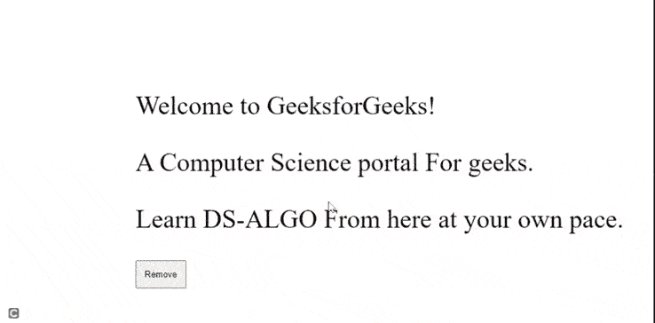

# 如何使用 jQuery 从 DOM 中移除所有段落？

> 原文:[https://www . geeksforgeeks . org/如何使用-jquery/](https://www.geeksforgeeks.org/how-to-remove-all-paragraphs-from-the-dom-using-jquery/) 从 dom 中移除所有段落

要移除元素和内容，我们使用 jQuery[**remove()**](https://www.geeksforgeeks.org/jquery-remove/)**方法移除所选元素及其内部的所有内容，还会移除与该目标元素关联的所有绑定事件。**

****语法:****

```
$(selector).remove() 
```

****示例:****

## **超文本标记语言**

```
<!DOCTYPE html>
<html>
<head>
    <script
      src="https://code.jquery.com/jquery-3.6.0.min.js"
      integrity="sha256-/xUj+3OJU5yExlq6GSYGSHk7tPXikynS7ogEvDej/m4="
      crossorigin="anonymous"
    >
    </script>
    <!-- JQuery CDN directed from the JQuery website -->
    <script>
      $(document).ready(function () {
        $("button").click(function () {
          $("p").remove();
        });
      });
    </script>

</head>
<body>
 <div style="padding-top: 90px; padding-left: 200px">
      <p style="font-size: 40px">
        Welcome to GeeksforGeeks!
      </p>
      <p style="font-size: 40px">
        Computer Science portal For geeks.
      </p>
      <p style="font-size: 40px;">
        Learn DS-ALGO From here at your own pace.
      </p>
      <button style="padding: 12px">
        Remove
      </button>
  </div>
</body>
</html>
```

****输出:****

**

remove()方法**