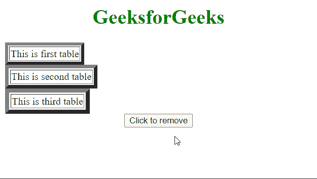

# 如何使用 jQuery 从每个匹配的元素中移除一个属性？

> 原文:[https://www . geeksforgeeks . org/如何使用-jquery/](https://www.geeksforgeeks.org/how-to-remove-an-attribute-from-each-matched-elements-using-jquery/) 从每个匹配的元素中移除属性

在本文中，我们将学习如何使用 JQuery 从每个匹配的元素中移除属性。 **JQuery** 是速度最快且轻量级的 JavaScript 库，用于简化 HTML/CSS 文档(更准确地说是文档对象模型(DOM))和 JavaScript 之间的交互。它以“少写多做”的座右铭而闻名它只是意味着你只需要写几行代码就可以实现你的目标。

**方法:**属性用于提供关于元素的额外信息。它总是在起始标记中指定。我们可以使用 JQuery 中的 **removeAttr()方法**轻松移除页面中的属性。此方法用于从每个匹配的元素中移除属性。

**语法:**

```html
selector.removeAttr( name )
```

**参数:**该方法有一个参数，如上所述，如下所述。

*   **名称:**这是必须从页面中移除的属性的名称。

下面的例子将有助于更好地理解这种方法。

**示例:**在本例中，我们将使用 **removeAttr()方法**从每个匹配的元素中移除一个属性。

## 超文本标记语言

```html
<html>

<head>
    <script type="text/javascript" 
            src=
"https://ajax.googleapis.com/ajax/libs/jquery/2.1.3/jquery.min.js">
    </script>
    <style>
        body {
            text-align: center;
        }
    </style>

</head>

<body>
    <h1 style="color:green">GeeksforGeeks</h1>
    <table border="5px">
        <tr>
            <td>This is first table</td>
        </tr>
    </table>

    <table border="6px">
        <tr>
            <td>This is second table</td>
        </tr>
    </table>

    <table border="7px">
        <tr>
            <td>This is third table</td>
        </tr>
    </table>

    <button id="btn">Click to remove</button>

    <script type="text/javascript">
        $("#btn").click(function () {
            $("table").removeAttr("border");
        });
    </script>
</body>

</html>
```

**输出:**

