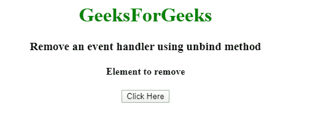
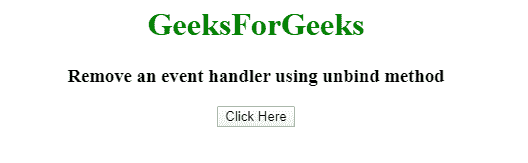
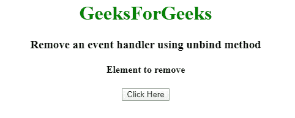
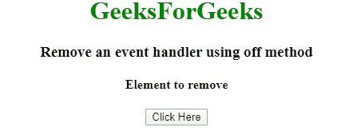
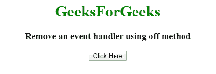

# 如何使用 jQuery 移除事件处理程序？

> 原文:[https://www . geeksforgeeks . org/如何使用-jquery/](https://www.geeksforgeeks.org/how-to-remove-an-event-handler-using-jquery/) 移除事件处理程序

这里的任务是移除 jQuery/JavaScript 中的一个事件处理程序。下面讨论解决这个问题的三种方法:
**使用 unbind()方法:**这是 jQuery 中的一种内置方法，用于移除任何选定的事件处理程序。
**语法:**

```html
$(selector).unbind(event, function, eventObj)
```

**进场:**

*   选择要移除事件处理程序的选择器。
*   使用**解除绑定()**方法移除事件。
*   点击解除绑定的函数后，将移除事件处理程序。

**例 1:**

## 超文本标记语言

```html
<!DOCTYPE html>  
<html>  

<head> 
    <title> 
        jQuery | How to remove an event handler?
    </title> 

 </head> 

 <body style = "text-align:center;">  

    <h1 style = "color:green;" >  
        GeeksForGeeks  
    </h1>

    <h3>
        Remove an event handler using unbind method
    </h3>

    <h4>Element to remove</h4>    
    <button> 
        Click Here 
    </button> 

    <script>
        $(document).ready(function() {
            $("h4").click(function() {
                $(this).slideToggle();
            });

            $("button").click(function() {
                $("h4").unbind();
            });
        });
    </script>
</body>  

</html> 
```

**输出:**

*   **点击任意位置前:**



*   **点击元素 h4 后:**



*   **点击按钮后事件将不起作用:**



**使用 off()方法:**用于移除附带 on()方法的事件处理程序。
**语法:**

```html
$(selector).off(event, selector, function(eventObj), map)
```

**进场:**

*   选择要移除事件处理程序的选择器。
*   使用 **off()** 方法移除事件。
*   点击解除绑定的函数后，将移除事件处理程序。

**例 2:**

## 超文本标记语言

```html
<!DOCTYPE html>  
<html>  

<head> 
    <title> 
        jQuery | How to remove an event handler?
    </title> 

 </head> 

 <body style = "text-align:center;">  

    <h1 style = "color:green;" >  
        GeeksForGeeks  
    </h1>

    <h3>
        Remove an event handler using off method
    </h3>

    <h4>Element to remove</h4>    
    <button> 
        Click Here 
    </button> 

    <script>
        $(document).ready(function() {
            $("h4").click(function() {
                $(this).slideToggle();
            });

            $("button").click(function() {
                $("h4").off();
            });
        });
    </script>
</body>  

</html> 
```

**输出:**

*   **点击任意位置前:**



*   **点击元素 h4 后:**



*   **点击按钮后事件将不起作用:**

