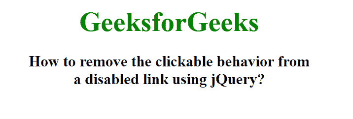

# 如何使用 jQuery 移除禁用链接的可点击行为？

> 原文:[https://www . geesforgeks . org/how-remove-clickable-behavior-from-a-disabled-link-use-jquery/](https://www.geeksforgeeks.org/how-to-remove-clickable-behavior-from-a-disabled-link-using-jquery/)

在本文中，我们将看到如何使用 jQuery 从禁用的链接中移除可点击行为。要删除可点击的行为，我们将使用 removeAttr()方法。removeAttr()方法用于从所选元素中移除一个或多个属性。

**语法:**

```
$(selector).removeAttr(attribute)
```

**参数:**该方法接受强制的单参数属性。它用于指定要移除的一个或多个属性。使用空间运算符可以分隔多个属性。

在本文中，我们将使用 removeAttr()方法移除 href 属性。

**示例:**

## 超文本标记语言

```
<!DOCTYpe html>
<html>

<head>
    <title>
        How to remove clickable behavior from
        a disabled link using jQuery?
    </title>

    <script src=
"https://ajax.googleapis.com/ajax/libs/jquery/3.3.1/jquery.min.js">
    </script>

    <script>
        $(document).ready(function () {
            $("body").css("text-align", "center");
            $("h1").css("color", "green");
            $("a").css({
                fontSize: "34px",
                fontWeight: "bold",
                color: "green",
                textDecoration: "none"
            })
            $("a").each(function () {
                if ($(this).hasClass("disabled")) {
                    $(this).removeAttr("href");
                }
            });
        });
    </script>
</head>

<body>
    <a href="https://www.geeksforgeeks.org/" 
        class="disabled">
        GeeksforGeeks
    </a>

    <h3>
        How to remove the clickable behavior from
        <br>a disabled link using jQuery?
    </h3>
</body>

</html>
```

**输出:**

