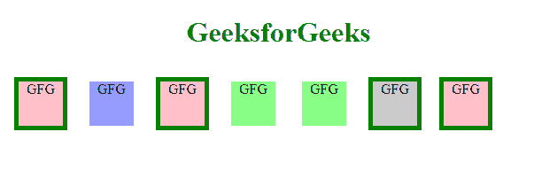

# 如何使用 jQuery 从匹配元素集中移除与指定选择器匹配的元素？

> 原文:[https://www . geesforgeks . org/如何使用-jquery/](https://www.geeksforgeeks.org/how-to-remove-elements-that-matches-the-specified-selector-from-the-set-of-matched-elements-using-jquery/) 从匹配元素集中移除与指定选择器匹配的元素

任务是使用 [jQuery](https://www.geeksforgeeks.org/jquery-tutorials/) 从匹配元素集中移除与指定选择器匹配的元素。jQuery 是最快和轻量级的 JavaScript 库，用于简化 [HTML/CSS](https://www.geeksforgeeks.org/web-technology/html-css/) 文档，或者更准确地说[文档对象模型(DOM)](https://www.geeksforgeeks.org/dom-document-object-model/) 和 [JavaScript](https://www.geeksforgeeks.org/javascript-tutorial/) 之间的交互。

jQuery 以其座右铭**“**少写多做而闻名。**”**简单来说就是只需要写几行代码就可以达到目的。

**进场:**我们可以使用 [**完成这个任务。**](https://www.geeksforgeeks.org/jquery-not-method-with-examples/) 方法不在 jQuery 中。此方法用于从匹配元素集中移除元素。

**示例:**下面的代码演示了显示粗体绿色边框的 [< div >](https://www.geeksforgeeks.org/div-tag-html/) 元素，它们的类不是“绿色”，也没有 [id](https://www.geeksforgeeks.org/html-id-attributes/) 为“蓝色”。这段代码还使用了 jQuery [**css()**](The css() method in JQuery is used to change the style property of the selected element.) 方法。jQuery 中的 **css()** 方法用于更改所选元素的样式属性，该属性用于为所选元素提供绿色边框。

## 超文本标记语言

```
<!doctype html>
<html lang="en">

<head>
    <meta charset="utf-8">
    <script src=
"https://code.jquery.com/jquery-3.5.0.js">
    </script>

    <style>
        div {
            width: 50px;
            height: 50px;
            margin: 10px;
            float: left;
            background: pink;
            border: 5px solid white;
        }

        .green {
            background: #8f8;
        }

        .gray {
            background: #ccc;
        }

        #blueone {
            background: #99f;
        }

        body {
            text-align: center;
        }
    </style>
</head>

<body>
    <h1 style="color:green">
        GeeksforGeeks
    </h1>

    <div>GFG</div>
    <div id="blueone">GFG</div>
    <div>GFG</div>
    <div class="green">GFG</div>
    <div class="green">GFG</div>
    <div class="gray">GFG</div>
    <div>GFG</div>

    <script>
        $("div").not(".green, #blueone")
            .css("border-color", "Green");
    </script>
</body>

</html>
```

**输出:**

