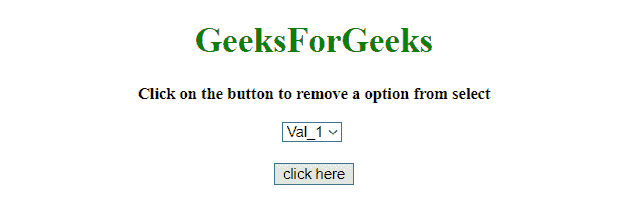
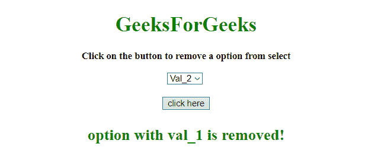
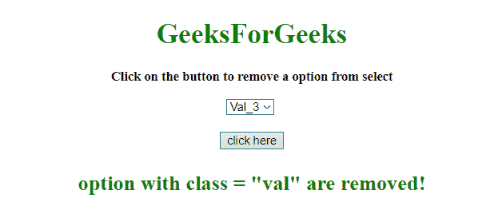

# 如何使用 jQuery 从 select 元素中移除选项？

> 原文:[https://www . geeksforgeeks . org/如何使用-jquery/](https://www.geeksforgeeks.org/how-to-remove-options-from-select-element-using-jquery/) 从选择元素中移除选项

任务是使用 jQuery 从 select 元素中移除选项元素。

**进场:**

*   从选择中选择需要删除的选项。
*   使用 JQuery **[remove()](https://www.geeksforgeeks.org/jquery-remove/)** 方法从 HTML 文档中删除该选项。

**示例 1:** 本示例使用**移除()方法**移除选项*瓦尔= '瓦尔 _1'* 。

```
<!DOCTYPE HTML>
<html>

<head>
    <title>
        JQuery | Remove options from select.
    </title>
    <script src=
"https://ajax.googleapis.com/ajax/libs/jquery/3.4.0/jquery.min.js">
    </script>
</head>

<body style="text-align:center;" id="body">
    <h1 style="color:green;">  
            GeeksForGeeks  
        </h1>
    <p id="GFG_UP" 
       style="font-size: 15px;
              font-weight: bold;">
    </p>
    <select>
        <option value="val_1"> Val_1</option>
        <option value="val_2"> Val_2</option>
        <option value="val_3"> Val_3</option>
        <option value="val_4"> Val_4</option>
    </select>
    <br>
    <br>
    <button>
        click here
    </button>
    <p id="GFG_DOWN"
       style="color: green; 
              font-size: 24px; 
              font-weight: bold;">
    </p>
    <script>
        $('#GFG_UP').text(
          'Click on the button to '+
          'remove a option from select');

        $('button').on('click', function() {
            $("option[value='val_1']").remove();
            $('#GFG_DOWN').text(
              'option with val_1 is removed!');
        });
    </script>
</body>

</html>
```

**输出:**

*   **到达底部前:**
    
*   **到达底部后:**
    

**示例 2:** 本示例使用**移除()方法**移除选项*=【瓦尔】*。

```
<!DOCTYPE HTML>
<html>

<head>
    <title>
        JQuery | Remove options from select.
    </title>
    <script src=
"https://ajax.googleapis.com/ajax/libs/jquery/3.4.0/jquery.min.js">
    </script>
</head>

<body style="text-align:center;" 
      id="body">
    <h1 style="color:green;">  
            GeeksForGeeks  
        </h1>
    <p id="GFG_UP"
       style="font-size: 15px;
              font-weight: bold;">
    </p>
    <select>
        <option class="val" value="val_1">
          Val_1
      </option>
        <option class="val" value="val_2"> 
          Val_2
      </option>
        <option value="val_3">
          Val_3
      </option>
        <option value="val_4"> 
          Val_4
      </option>
    </select>
    <br>
    <br>
    <button>
        click here
    </button>
    <p id="GFG_DOWN" 
       style="color: green;
              font-size: 24px; 
              font-weight: bold;">
    </p>
    <script>
        $('#GFG_UP').text(
          'Click on the button to remove a option from select');
        $('button').on('click', function() {
            $("option[class='val']").remove();
            $('#GFG_DOWN').text(
              'option with class = "val" are removed!');
        });
    </script>
</body>

</html>
```

**输出:**

*   **到达底部前:**
    
*   **到达底部后:**
    